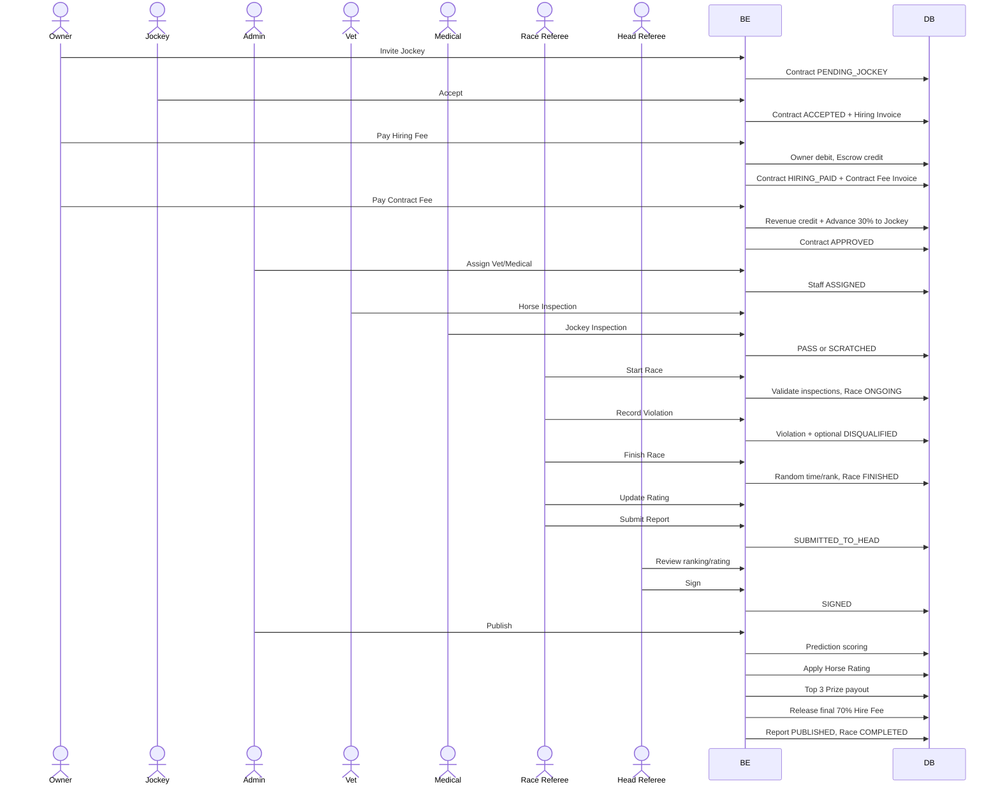

/mo# Phân tích kỹ thuật các luồng nghiệp vụ cốt lõi

## 0. Thông tin tài liệu

- Ngày đối chiếu source: 24/07/2026.
- Phạm vi:
  - Luồng 05 — Hợp đồng giữa Chủ ngựa và Kỵ sĩ.
  - Luồng 07 — Phân công nhân sự và kiểm tra Ngựa/Kỵ sĩ.
  - Luồng 11 — Thanh toán giải thưởng và giải ngân tiền thuê Kỵ sĩ.
  - Chấm điểm Horse Rating thủ công.
  - Ghi nhận vi phạm trong Race.
- Tài liệu mô tả **code BE hiện tại**, không mô tả các walkthrough hoặc tài liệu cũ nếu chúng khác source.
- Kết quả kiểm tra kỹ thuật gần nhất: Maven chạy 103 test, không có failure hoặc error.

### Kết luận nhanh

Các happy path chính đã được triển khai và có thể dùng để demo:

1. Owner mời Jockey, Jockey chấp nhận, Owner thanh toán đủ hai hóa đơn và Contract tự có hiệu lực.
2. Admin phân công Vet/Medical Staff, hai bên khám trong đúng khung giờ, entry không đạt bị `SCRATCHED`.
3. Race Referee start/finish race, nhập Rating, lập report; Head Referee duyệt và ký; Admin publish.
4. Khi Final Race được publish, hệ thống cộng Rating, chia thưởng Top 3 và giải ngân 70% tiền thuê còn lại.
5. Race Referee ghi vi phạm với hình phạt `WARNING` hoặc `DISQUALIFIED`.

Tuy nhiên, mục 7 của tài liệu này vẫn ghi nhận một số edge case chưa được xử lý tối ưu. Việc toàn bộ unit test pass không đồng nghĩa các tình huống đồng thời hoặc dữ liệu DB bất thường đã được bảo vệ đầy đủ.

---

# 1. Kiến trúc và quy ước chung

## 1.1. Kiến trúc source

Project sử dụng kiến trúc phân tầng:

```text
HTTP Request
  → Controller
  → Service interface
  → ServiceImpl
  → Repository
  → MySQL
  → Mapper
  → DTO Response
  → ApiResponse
```

Vai trò từng tầng:

| Tầng | Vai trò |
|---|---|
| Controller | Khai báo endpoint, role, parse request, kích hoạt Bean Validation |
| DTO Request | Khai báo dữ liệu đầu vào và validation bằng Jakarta Validation |
| ServiceImpl | Chứa nghiệp vụ, kiểm tra trạng thái, phân quyền theo dữ liệu và transaction |
| Repository | Đọc/ghi JPA, một số query sử dụng pessimistic lock |
| Entity | Ánh xạ bảng, quan hệ và unique constraint |
| Mapper | Chuyển Entity thành Response DTO |
| ErrorCode/AppException | Chuẩn hóa business error |
| BusinessNotificationEventService | Ghi nhận sự kiện thông báo sau thay đổi nghiệp vụ |

## 1.2. Phân quyền

Phân quyền có hai lớp:

1. Phân quyền theo role bằng `@PreAuthorize`.
2. Phân quyền theo quan hệ dữ liệu trong Service:
   - Contract phải thuộc Owner/Jockey đang đăng nhập.
   - Vet/Medical Staff phải đúng người được assign cho Race.
   - Race Referee phải được assign trực tiếp vào Race.
   - Head Referee phải là `Round.headReferee`.

## 1.3. Response thành công

Response mặc định:

```json
{
  "code": 200,
  "message": "Success",
  "result": {}
}
```

Được khai báo tại:

```text
src/main/java/com/swp391/horseracing/dto/common/ApiResponse.java
```

## 1.4. Response lỗi

Business exception:

```json
{
  "code": 1604,
  "message": "Contract already exists"
}
```

Bean Validation:

```json
{
  "code": 1010,
  "message": "Validation failed",
  "result": [
    {
      "field": "reason",
      "message": "Reason is required"
    }
  ]
}
```

Quy tắc lỗi chung:

| Trường hợp | Error code |
|---|---:|
| DTO vi phạm `@NotNull`, `@NotBlank`, `@Min`, `@Size`... | `1010 VALIDATION_FAILED` |
| JSON sai cú pháp hoặc enum không tồn tại | `1001 INVALID_REQUEST` |
| Chưa đăng nhập | `1005 UNAUTHENTICATED` |
| Role không được phép | `1004 ACCESS_DENIED` |
| Exception chưa được handler riêng | `1008 INTERNAL_SERVER_ERROR` |

---

# 2. Luồng 05 — Contract Matching

## 2.1. Tổng quan nghiệp vụ

### Mục đích

Tạo quan hệ chính thức giữa:

- một Horse Registration đã được duyệt;
- một Jockey Registration đã được duyệt;
- trong cùng một Tournament;
- kèm phí thuê Kỵ sĩ và tỷ lệ chia giải thưởng.

Contract đồng thời quản lý:

- trạng thái lời mời;
- trạng thái thanh toán;
- tiền được giữ trong escrow;
- khoản tạm ứng 30%;
- khoản cuối 70%;
- tỷ lệ chia thưởng Owner/Jockey.

### Luồng người dùng

```text
Owner chọn Horse Registration + Jockey Registration
  → Owner gửi lời mời
  → Jockey Accept hoặc Reject

Nếu Reject:
  → Contract kết thúc ở REJECTED

Nếu Accept:
  → Tạo hóa đơn JOCKEY_HIRING_FEE
  → Owner thanh toán Hiring Fee
  → Tiền vào SYSTEM_ESCROW
  → Contract chuyển HIRING_PAID
  → Tạo hóa đơn CONTRACT_CREATION_FEE
  → Owner thanh toán phí tạo hợp đồng
  → Phí vào SYSTEM_REVENUE
  → Hệ thống tự kích hoạt Contract
  → Chuyển trước 30% từ SYSTEM_ESCROW sang Jockey
  → Contract chuyển APPROVED
  → 70% còn lại tiếp tục nằm trong Escrow
```

### Không còn Admin review Contract

Code hiện tại không có bước:

```text
PENDING_ADMIN_REVIEW → Admin approve/reject
```

Contract tự chuyển sang `APPROVED` sau khi hai hóa đơn đều `PAID` và trạng thái escrow hợp lệ.

Enum `PENDING_ADMIN_REVIEW` vẫn còn trong source nhưng không có luồng hiện tại nào chủ động gán trạng thái này.

## 2.2. State machine

### ContractStatus

```text
PENDING_JOCKEY
  ├─ Jockey reject → REJECTED
  ├─ Owner cancel → CANCELLED
  └─ Jockey accept → ACCEPTED
                         ├─ Jockey cancel khi Owner chưa trả tiền → CANCELLED
                         ├─ Owner cancel → CANCELLED
                         └─ Owner trả Hiring Fee → HIRING_PAID
                                                      ├─ Owner cancel/refund → CANCELLED
                                                      └─ Owner trả Contract Fee → APPROVED
                                                                                  ├─ Owner cancel trước khi Race khóa → CANCELLED
                                                                                  └─ Final Race published → Final payout RELEASED
```

### Trạng thái tiền

| Mốc | Payment status | Escrow status | Advance | Final |
|---|---|---|---|---|
| Mới mời | `UNPAID` | `NOT_HELD` | `NOT_PAID` | `NOT_RELEASED` |
| Đã trả Hiring Fee | `PAID` | `HELD` | `NOT_PAID` | `NOT_RELEASED` |
| Contract có hiệu lực | `PAID` | `PARTIALLY_RELEASED` | `PAID` | `NOT_RELEASED` |
| Final Race published | `PAID` | `RELEASED` | `PAID` | `RELEASED` |

## 2.3. API liên quan

### Owner

| Method | API | Mục đích |
|---|---|---|
| GET | `/api/owner/contracts` | Danh sách Contract của Owner |
| GET | `/api/owner/contracts/{id}` | Chi tiết Contract |
| POST | `/api/owner/contracts/invite` | Mời Jockey |
| POST | `/api/owner/contracts/{id}/cancel` | Hủy Contract theo chính sách |
| POST | `/api/contracts/{id}/pay-hiring-fee` | Thanh toán phí thuê |
| POST | `/api/contracts/{id}/pay-contract-fee` | Thanh toán phí tạo Contract |
| GET | `/api/invoices/my-invoices` | Danh sách hóa đơn của user |
| POST | `/api/invoices/{id}/pay` | Thanh toán hóa đơn theo invoice ID |

### Jockey

| Method | API | Mục đích |
|---|---|---|
| GET | `/api/jockey/contracts` | Danh sách Contract của Jockey |
| GET | `/api/jockey/contracts/{id}` | Chi tiết Contract |
| GET | `/api/jockey/contracts/invitations` | Danh sách lời mời `PENDING_JOCKEY` |
| POST | `/api/jockey/contracts/{id}/accept` | Chấp nhận lời mời |
| POST | `/api/jockey/contracts/{id}/reject` | Từ chối lời mời |
| POST | `/api/jockey/contracts/{id}/cancel` | Hủy sau khi accept nhưng Owner chưa thanh toán |

### Admin

| Method | API | Mục đích |
|---|---|---|
| GET | `/api/admin/contracts?status=...` | Tra cứu Contract theo status |
| GET | `/api/admin/contracts/approved/tournaments/{tournamentId}` | Lấy Contract có hiệu lực của Tournament |

Admin không có API approve/reject Contract và cũng không có API release 70% thủ công.

## 2.4. Validate Rules

### Request tạo lời mời

| Field | Rule | Khi sai |
|---|---|---|
| `tournamentRegistrationId` | Không null | `1010` |
| `jockeyTournamentRegistrationId` | Không null | `1010` |
| `ownerPrizeSharePercent` | Không null, không âm | `1010` |
| `jockeyPrizeSharePercent` | Không null, không âm | `1010` |
| Tổng hai tỷ lệ | Phải bằng 100, tolerance `0.0001F` | `1603 INVALID_PRIZE_SHARE` |
| Mỗi tỷ lệ | Trong `[0, 100]` | `1603` |

### Business validation khi invite

| Điều kiện | Error |
|---|---|
| Horse/Jockey registration tồn tại | `1503 TOURNAMENT_REGISTRATION_NOT_FOUND` |
| Horse registration thuộc Owner hiện tại | `1302 HORSE_NOT_BELONG_TO_OWNER` |
| Cả hai registration là `APPROVED` | `1532 INVALID_REGISTRATION_STATUS` |
| Cả hai thuộc cùng Tournament | `1601 TOURNAMENT_NOT_MATCH` |
| Hire fee của Jockey registration lớn hơn 0 | `1602 INVALID_HIRE_FEE` |
| Tournament đang ở `JOCKEY_MATCHING` | `1537 INVALID_PHASE_TRANSITION` |
| Không có Contract active cùng cặp registration | `1604 CONTRACT_ALREADY_EXISTS` |

Status được xem là active khi kiểm tra trùng:

```text
PENDING_JOCKEY
ACCEPTED
HIRING_PAID
PENDING_ADMIN_REVIEW
APPROVED
```

### Jockey accept/reject/cancel

| Thao tác | Điều kiện | Error |
|---|---|---|
| Accept | Contract thuộc Jockey hiện tại | `1005 UNAUTHENTICATED` |
| Accept | Contract phải `PENDING_JOCKEY` | `1547 INVALID_CONTRACT_STATUS` |
| Accept | Hai registration vẫn `APPROVED` | `1532` |
| Reject | Chỉ `PENDING_JOCKEY` | `1547` |
| Cancel | Chỉ `ACCEPTED` | `1610 CONTRACT_CANCELLATION_NOT_ALLOWED` |
| Cancel | Hiring invoice còn `UNPAID` | `1610` |
| Cancel | `paymentStatus=UNPAID` | `1610` |
| Cancel | `escrowStatus=NOT_HELD` | `1610` |
| Reject/Cancel | Reason không trống, tối đa 500 ký tự | `1010` |

### Thanh toán

| Điều kiện | Error |
|---|---|
| Invoice tồn tại | `1409 INVOICE_NOT_FOUND` |
| Invoice thuộc user hiện tại | `1422 INVOICE_ACCESS_DENIED` |
| Invoice chưa `PAID` | `1410 INVOICE_ALREADY_PAID` |
| Invoice không `CANCELLED` | `1412 INVOICE_CANCELLED` |
| Invoice không `REFUNDED` | `1421 INVOICE_ALREADY_REFUNDED` |
| Invoice không quá hạn | `1423 INVOICE_EXPIRED` |
| User wallet và system wallet tồn tại | `1401` / `1402` |
| Wallet không `FROZEN` hoặc `CLOSED` | `1415` / `1416` |
| User đủ số dư | `1403 INSUFFICIENT_BALANCE` |
| Hiring Fee chỉ trả khi Contract `ACCEPTED` | `1547` |
| Contract Fee chỉ trả khi Contract `HIRING_PAID` | `1547` |

### Tự kích hoạt Contract

| Điều kiện | Error |
|---|---|
| Contract `HIRING_PAID` | `1547` |
| Cả Hiring Fee và Contract Fee đều `PAID` | `1411 INVOICE_NOT_PAID` |
| `paymentStatus=PAID` | `1605 CONTRACT_HIRING_FEE_NOT_PAID` |
| `escrowStatus=HELD` | `1606 INVALID_ESCROW_STATUS` |
| `escrowAmount=hireFee` | `1606` |
| Chưa có transaction tạm ứng trước đó | `1547` |
| SYSTEM_ESCROW đủ tiền chuyển 30% | `1403` |

### Owner cancel

Owner chỉ được cancel khi:

- Contract thuộc Owner.
- Status thuộc nhóm cho phép.
- Tournament chưa ở `RACING`, `RESULT_PENDING`, `RESULT_PUBLISHED`, `FINISHED`.
- Tất cả RaceEntry liên quan vẫn thuộc Race `SCHEDULING`.
- Request có reason không trống, tối đa 1000 ký tự.

Nếu Contract đã `APPROVED`, hệ thống chỉ refund số tiền còn lại trong escrow; khoản 30% đã chuyển cho Jockey không bị thu hồi.

## 2.5. Execution Flow

### A. Owner mời Jockey

```text
OwnerContractController.inviteJockey()
  → ContractServiceImpl.inviteJockey()
    → UserCurrentService.getCurrentOwner()
    → HorseTournamentRegistrationRepository.findById()
    → JockeyTournamentRegistrationRepository.findById()
    → validateInvite()
    → JockeyHorseContractRepository.save()
    → BusinessNotificationEventService.contractInvited()
    → ContractMapper.toContractResponse()
```

### B. Jockey accept

```text
JockeyContractController.acceptContract()
  → ContractServiceImpl.acceptContract()
    → UserCurrentService.getCurrentUser()
    → ContractRepository.findForUpdateByContractId()
    → Lock Horse Registration
    → Lock Jockey Registration
    → Validate ownership/status
    → Contract ACCEPTED
    → cancelOtherInvite()
    → ContractRepository.save()
    → InvoiceService.createHiringFeeInvoice()
    → Notification.contractAccepted()
```

### C. Owner trả Hiring Fee

```text
PaymentController.payHiringFee()
  → ContractServiceImpl.payHiringFee()
    → PaymentServiceImpl.payHiringFee()
      → Validate Contract ACCEPTED và Owner
      → PaymentServiceImpl.payInvoice()
        → Lock Invoice
        → Lock Contract
        → Lock USER_MAIN wallet
        → Lock SYSTEM_ESCROW wallet
        → Debit USER_MAIN
        → Credit SYSTEM_ESCROW
        → Save 2 Transaction chung transactionGroupId
        → Invoice = PAID
        → InvoicePaymentCompleteService.handleAfterPaid()
          → ContractPaymentService.markHiringFeePaid()
            → Contract = HIRING_PAID
            → escrowAmount = hireFee
            → escrowStatus = HELD
            → Create CONTRACT_CREATION_FEE invoice
```

### D. Owner trả phí tạo Contract

```text
PaymentController.payContractFee()
  → ContractServiceImpl.payContractCreationFee()
    → PaymentService.payInvoice()
      → Debit Owner USER_MAIN
      → Credit SYSTEM_REVENUE
      → Invoice = PAID
      → InvoicePaymentCompleteService.handleAfterPaid()
        → ContractActivationService.activateAfterFullPayment()
          → Lock Contract
          → Lock hai Invoice
          → Validate escrow
          → Lock SYSTEM_ESCROW
          → Lock Jockey USER_MAIN
          → Chuyển 30% cho Jockey
          → Save transaction debit/credit
          → Contract = APPROVED
          → escrowAmount = 70%
          → escrowStatus = PARTIALLY_RELEASED
          → advancePayoutStatus = PAID
```

## 2.6. Database và Transaction

- Các thay đổi invite, accept, reject, cancel và payment chạy trong `@Transactional`.
- Các bản ghi quan trọng được pessimistic lock:
  - Contract.
  - Invoice.
  - User wallet.
  - System wallet.
  - Horse/Jockey registration trong lúc accept.
- Mỗi lần chuyển tiền tạo hai transaction:
  - một bản ghi debit;
  - một bản ghi credit;
  - dùng cùng `transactionGroupId`.
- Nếu một bước trong payment callback thất bại, transaction thanh toán hiện tại rollback.

## 2.7. Edge Cases

1. `PENDING_ADMIN_REVIEW` vẫn còn trong enum và một số danh sách kiểm tra nhưng không còn nghiệp vụ tạo trạng thái này.
2. Bảng Contract chưa có unique constraint để bảo vệ một Horse/Jockey registration chỉ có một Contract active. Hai accept đồng thời hiện phụ thuộc nhiều vào pessimistic lock và có nguy cơ deadlock.
3. Tỷ lệ giải thưởng dùng `Float`; nghiệp vụ tiền tệ nên ưu tiên `BigDecimal`.
4. Owner cancel Contract `APPROVED` chỉ nhận lại 70% còn trong escrow. Đây cần được ghi rõ là phí hủy hay chính sách không hoàn lại 30%.
5. Invoice chưa có unique constraint `(contract_id, invoice_type)`.
6. System wallet chưa có unique constraint bảo đảm chỉ tồn tại một ví cho mỗi `walletPurpose`.

---

# 3. Luồng 07 — Inspection

## 3.1. Tổng quan nghiệp vụ

### Mục đích

Chỉ cho phép cặp Horse/Jockey đủ điều kiện sức khỏe xuất phát:

- Admin phân công một Veterinarian và một Medical Staff cho Race.
- Vet khám Horse.
- Medical Staff khám Jockey.
- Cả hai kết quả phải `PASS` và `CONFIRMED`.
- Nếu một bên `FAIL`, RaceEntry chuyển `SCRATCHED`.
- Khi start Race, hệ thống bỏ qua entry bị rút/scratch/disqualified và kiểm tra các entry còn active.

### Khung giờ

Với Race bắt đầu tại `T`:

```text
inspectionOpenAt  = T - inspectionOpenMinutesBefore
inspectionCloseAt = T - inspectionCloseMinutesBefore
```

Mặc định nghiệp vụ thường dùng:

```text
T-90 → mở khám
T-30 → đóng khám
```

## 3.2. API

| Role | Method | API | Mục đích |
|---|---|---|---|
| Admin | POST | `/api/admin/races/{raceId}/inspection-staff/assign` | Gán Vet/Medical thủ công |
| Admin | POST | `/api/admin/races/{raceId}/inspection-staff/auto-assign` | Tự chọn nhân sự AVAILABLE |
| Vet | POST | `/api/vet/race-entries/{entryId}/horse-inspection` | Khám Horse |
| Vet | GET | `/api/vet/race-entries/{entryId}/horse-inspection` | Xem phiếu khám Horse |
| Medical | POST | `/api/medical/race-entries/{entryId}/jockey-inspection` | Khám Jockey |
| Medical | GET | `/api/medical/race-entries/{entryId}/jockey-inspection` | Xem phiếu khám Jockey |
| Referee | GET | `/api/referee/races/{raceId}/start-readiness` | Kiểm tra khả năng start |
| Referee | POST | `/api/referee/races/{raceId}/start` | Start Race |

## 3.3. Request validation

### Assign nhân sự

```json
{
  "veterinarianId": "uuid",
  "medStaffId": "uuid"
}
```

Hai ID đều bắt buộc; thiếu field trả `1010`.

### Phiếu khám Horse

| Field | Rule |
|---|---|
| `result` | Bắt buộc, `PASS` hoặc `FAIL` |
| `actualWeight` | Bắt buộc, lớn hơn 0 |
| `actualBreed` | Bắt buộc, enum HorseBreed |
| `dopingDetected` | Bắt buộc |
| `handicapConfirmed` | Bắt buộc về nghiệp vụ nếu Tournament bật handicap và kết quả PASS |
| `note` | Optional |
| `handicapWeight` | Có trong DTO nhưng giá trị thực tế do BE tính lại |

### Phiếu khám Jockey

| Field | Rule |
|---|---|
| `result` | Bắt buộc, `PASS` hoặc `FAIL` |
| `actualWeight` | Bắt buộc, lớn hơn 0 |
| `dopingDetected` | Bắt buộc |
| `note` | Optional |

## 3.4. Business validation

### Phân công nhân sự

| Điều kiện | Error |
|---|---|
| Race tồn tại | `1508 RACE_NOT_FOUND` |
| Race chỉ ở `SCHEDULING` hoặc `SCHEDULED` | `1725 INSPECTION_STAFF_ASSIGNMENT_NOT_ALLOWED` |
| Chưa có bất kỳ inspection record | `1725` |
| Nếu `SCHEDULED`, thời điểm hiện tại phải trước lúc mở khám | `1725` |
| Vet/Medical tồn tại | `1704` / `1701` |
| Vet/Medical không `SUSPENDED` | `1704` / `1703` |
| Nhân sự chưa `ASSIGNED` cho Race khác | `1705` / `1702` |
| Auto assign phải tìm được người `AVAILABLE` | `1707` / `1706` |

### Khám Horse/Jockey

| Điều kiện | Horse error | Jockey error |
|---|---:|---:|
| Entry tồn tại | `1550` | `1550` |
| Race là `SCHEDULED` | `1712` | `1712` |
| Entry là `CONFIRMED` | `1809` | `1809` |
| Race chưa start | `1808` | `1808` |
| Đã tới thời gian mở khám | `1807` | `1807` |
| Chưa quá thời gian đóng khám | `1808` | `1808` |
| Chưa tồn tại phiếu cùng loại | `1708` | `1709` |
| User có đúng profile | `1205` | `1206` |
| User đúng assignment của Race | `1710` | `1711` |
| PASS nhưng phát hiện doping | `1723` | `1724` |
| PASS nhưng giống thực tế khác giống đăng ký | `1723` | Không áp dụng |
| Handicap bật và PASS nhưng chưa confirm | `1717` | Không áp dụng |

### Start Race

1. Chỉ Race Referee được assign trực tiếp mới được start.
2. Referee không được `SUSPENDED`.
3. Race phải `SCHEDULED`.
4. Thời gian phải nằm trong:

```text
earliestStart = startTime - startEarlyToleranceMinutes
latestStart   = startTime + startLateToleranceMinutes
```

5. Entry active phải có:
   - Horse inspection `CONFIRMED + PASS`;
   - Jockey inspection `CONFIRMED + PASS`;
   - handicap được confirm nếu có ballast lớn hơn 0.
6. Số entry active tối thiểu:
   - Round không phải Final: `max(2, qualifiersPerRace)`.
   - Final: `2`.

Error chính:

| Điều kiện sai | Error |
|---|---|
| Referee không được assign | `1713 REFEREE_NOT_ASSIGNED_TO_RACE` |
| Race không `SCHEDULED` | `1712` |
| Start quá sớm | `1810 RACE_START_TOO_EARLY` |
| Start quá muộn | `1811 RACE_START_WINDOW_EXPIRED` |
| Thiếu Horse PASS | `1715 ENTRY_MISSING_HORSE_INSPECTION` |
| Thiếu Jockey PASS | `1716 ENTRY_MISSING_JOCKEY_INSPECTION` |
| Handicap chưa confirm | `1717` |
| Không đủ người xuất phát | `1718 RACE_NOT_ENOUGH_ACTIVE_ENTRIES` |

## 3.5. Execution Flow

### A. Admin assign nhân sự

```text
AdminController.assignInspectionStaff()
  → RaceInspectionStaffService.assign()
    → Lock Race
    → validateRaceCanAssignInspectionStaff()
    → Lock Medical Staff
    → Lock Veterinarian
    → Validate AVAILABLE/not SUSPENDED
    → Release assignment cũ nếu thay người
    → Staff status = ASSIGNED
    → Save RaceInspectionAssignment
```

Auto assign:

```text
AdminController.autoAssignInspectionStaff()
  → Lock Race
  → Lấy danh sách candidate AVAILABLE
  → Lock từng candidate theo ID
  → Chọn candidate đầu tiên vẫn AVAILABLE
  → Save assignment và status
```

### B. Vet khám Horse

```text
VetInspectionController.createHorseInspection()
  → HorseInspectionServiceImpl.createInspection()
    → Load RaceEntry
    → Validate Race/Entry/window/duplicate
    → Resolve Vet hiện tại
    → Validate assignment
    → So sánh doping + actualBreed
    → Nếu handicap:
       → Tìm rating cao nhất trong Race
       → HandicapService.calculateHandicap()
       → Lưu ballast do BE tính
    → Save HorseInspection với status CONFIRMED
    → Nếu FAIL:
       → RaceEntry = SCRATCHED
       → Ghi scratchedReason
       → Notify spectator và người liên quan
```

### C. Medical Staff khám Jockey

Luồng tương tự Horse inspection, nhưng:

- không so sánh giống;
- không tính handicap;
- PASS bị từ chối khi `dopingDetected=true`.

### D. Referee start Race

```text
RefereeRaceController.startRace()
  → RaceServiceImpl.startRace()
    → Lock Race
    → Validate direct Race Referee
    → Validate status + tolerance
    → Nếu inspectionFinalizedAt null:
       → finalizeRaceEntries()
       → Scratch entry thiếu một trong hai PASS
    → Load entries
    → Bỏ qua WITHDRAWN/SCRATCHED/DISQUALIFIED
    → Validate hai inspection cho entry active
    → Validate runtime minimum starters
    → Race = ONGOING
    → Round = ONGOING
    → Release Vet/Medical thành AVAILABLE
    → Save Race
    → Emit raceStarted notification event
```

## 3.6. Database và Transaction

- Một Race chỉ có một `RaceInspectionAssignment`.
- Một Entry chỉ có một `HorseInspection`.
- Một Entry chỉ có một `JockeyInspection`.
- Unique constraints:

```text
horse_inspections(entry_id)
jockey_inspections(entry_id)
race_inspection_staff_assignments(race_id)
```

- Assign staff khóa Race và khóa từng staff.
- Start Race khóa Race.
- `finalizeRaceEntries()` được khai báo `REQUIRES_NEW`; tuy nhiên khi được gọi nội bộ từ `startRace()` trong cùng class, Spring self-invocation không tạo proxy transaction mới.

## 3.7. Edge Cases

1. Không còn scheduler tự chốt đúng T-30. Entry thiếu inspection chỉ được lazy-finalize khi start Race.
2. Hai request khám cùng entry chạy đồng thời có thể cùng vượt qua `exists`; DB unique sẽ chặn request sau nhưng có thể bị trả thành `1008` nếu không map `DataIntegrityViolationException`.
3. Reschedule hiện xóa inspection và chuyển **mọi** entry về `CONFIRMED`, kể cả entry từng `WITHDRAWN` hoặc `DISQUALIFIED`.
4. `handicapWeight` tồn tại trong request nhưng BE bỏ qua và tự tính; FE không nên cho người dùng hiểu đây là giá trị họ tự nhập.
5. Chưa có threshold chênh lệch cân nặng để bắt buộc FAIL. Code chỉ lưu registered/actual weight.
6. `note` không bắt buộc khi FAIL.
7. `VETERINARIAN_NOT_FOUND` và `VETERINARIAN_SUSPENDED` đang cùng dùng numeric code `1704`, gây khó mapping lỗi phía FE.

---

# 4. Horse Rating thủ công

## 4.1. Tổng quan nghiệp vụ

### Mục đích

Rating phản ánh thành tích Horse sau mỗi Race, nhưng hệ thống không tự chọn số điểm.

```text
Race kết thúc
  → Hệ thống random finishTime và rank
  → Race Referee nhập ratingChange thủ công
  → BE validate ratingChange theo khoảng của Tournament
  → Race Referee submit report
  → Head Referee có thể điều chỉnh rank/status/rating
  → Nếu đổi rating, Head Referee phải nhập lý do
  → Head Referee ký report
  → Admin xem rating preview
  → Admin publish report
  → Rating mới được cộng vào Horse
  → Tạo HorseRatingHistory
```

API `POST /api/referee/races/{raceId}/finish` vẫn là API đúng để kết thúc Race và random `finishTime/rank`.

Tên method nội bộ hiện là `finishRaceWithRandomResults()`. Tên này mang tính kỹ thuật nhưng nghiệp vụ vẫn đúng vì method không random `ratingChange`.

## 4.2. Cấu hình Rating

Giá trị mặc định:

| Kết quả | Min | Max |
|---|---:|---:|
| Hạng 1 | +6 | +12 |
| Hạng 2 | +2 | +5 |
| Hạng 3 | +1 | +4 |
| Hạng 4–5 | 0 | +2 |
| Hạng 6 trở đi | -8 | 0 |
| DISQUALIFIED | -8 | 0 |

Nguồn mặc định:

```text
application.properties
  → HorseRatingProperties
  → khi tạo Tournament, copy vào các field rating* của Tournament
```

Khi chấm Race, hệ thống đọc giá trị đã lưu trong Tournament, không đọc lại properties để tự tính.

Rating config:

- Có thể sửa khi Tournament còn `DRAFT`.
- `min <= max`.
- Hạng 1–5 không được có min âm.
- Hạng khác và DISQUALIFIED không được có max dương.
- Mỗi lần thay đổi tăng `ratingPolicyVersion`.
- Khi publish Tournament, hệ thống ghi `ratingPolicyLockedAt`.

## 4.3. API

| Role | Method | API | Mục đích |
|---|---|---|---|
| Admin | GET | `/api/admin/tournaments/rating-config/default` | Lấy config mặc định |
| Referee | POST | `/api/referee/races/{raceId}/finish` | Kết thúc Race, random time/rank |
| Referee | POST | `/api/referee/races/{raceId}/results` | Tạo result thủ công |
| Referee | PUT | `/api/referee/races/{raceId}/results` | Cập nhật result/rating khi report còn Draft |
| Head Referee | GET | `/api/head-referee/races/{raceId}/results` | Xem ranking chi tiết |
| Head Referee | PUT | `/api/head-referee/races/{raceId}/results` | Điều chỉnh result/rating |
| Admin | GET | `/api/admin/races/{raceId}/rating-preview` | Preview khi report SIGNED |
| Admin | GET | `/api/admin/races/{raceId}/rating-changes` | Xem thay đổi sau publish |
| Admin | GET | `/api/admin/rounds/{roundId}/rating-summary` | Tổng hợp theo Round |
| Owner/Admin | GET | `/api/horses/{horseId}/rating-history` | Lịch sử Rating của Horse |

## 4.4. Validate Rules

### RaceResult

| Điều kiện | Error |
|---|---|
| Race tồn tại | `1508 RACE_NOT_FOUND` |
| Race đang `ONGOING` hoặc `FINISHED` | `2604 INVALID_RACE_RESULT_STATUS` |
| User là direct Race Referee | `1560 RACE_REFEREE_NOT_FOUND` |
| Entry thuộc đúng Race | `1001 INVALID_REQUEST` |
| Entry thực sự đã xuất phát | `1815 RACE_ENTRY_DID_NOT_START` |
| Không tạo result trùng entry | `2602 RACE_RESULT_ALREADY_EXISTS` |
| Rank không trùng trong Race | `2605 DUPLICATE_RACE_RESULT_RANK` |
| FINISHED bắt buộc rank và finishTime | `1001` |
| Rank >= 1 | `2607 RANK_MUST_BE_POSITIVE` |
| finishTime >= 0 | `2606 FINISH_TIME_MUST_BE_POSITIVE` |
| DISQUALIFIED phải có rank/finishTime null | Service tự set null |
| `ratingChange` không null | `1814 HORSE_RATING_CHANGE_REQUIRED` |
| Rating nằm đúng range | `1819 HORSE_RATING_CHANGE_OUT_OF_RANGE` |
| Report chưa Submitted/Signed/Published | `2612` / `2613` |

### Head Referee chỉnh kết quả

1. User phải là `Round.headReferee`.
2. Report phải `SUBMITTED_TO_HEAD`.
3. Request phải chứa đủ số result hiện tại.
4. Entry ID phải tồn tại trong result set.
5. Rank sau cập nhật vẫn unique.
6. Rating vẫn phải nằm trong range theo rank/status mới.
7. Nếu Head Referee đổi `ratingChange`, `ratingAdjustmentReason` bắt buộc.

Error:

```text
1004 ACCESS_DENIED
2617 RACE_REPORT_NOT_SUBMITTED
2601 RACE_RESULT_NOT_FOUND
2605 DUPLICATE_RACE_RESULT_RANK
1821 HORSE_RATING_ADJUSTMENT_REASON_REQUIRED
```

### Preview và apply

| Thao tác | Điều kiện | Error |
|---|---|---|
| Preview | Report phải `SIGNED` | `2614 RACE_REPORT_NOT_SIGNED` |
| Xem changes | Report phải `PUBLISHED` | `1817 RACE_REPORT_NOT_PUBLISHED` |
| Apply | Mỗi result có rating hợp lệ | `1814` / `1819` |
| Apply | Rating history chưa tồn tại | `1816 HORSE_RATING_ALREADY_APPLIED` |
| Apply | Tournament rating config hợp lệ | `1822 INVALID_HORSE_RATING_CONFIG` |

## 4.5. Execution Flow

### A. Finish Race

```text
RefereeRaceController.finishRace()
  → RaceResultService.finishRaceWithRandomResults()
    → Lock Race
    → Validate ONGOING + direct Race Referee
    → Load actual starters
    → Bỏ qua withdrawn/scratched
    → Sinh tốc độ ngẫu nhiên 15–18 m/s
    → finishTime = distance / speed
    → Sort theo finishTime
    → Gán rank tăng dần
    → Tạo result DISQUALIFIED cho entry đã bị loại
    → Race = FINISHED
    → Save RaceResult
```

Các result vừa random chưa có `ratingChange`; Race Referee phải gọi PUT results để nhập Rating trước khi submit report.

### B. Referee nhập Rating

```text
RaceResultController.updateResults()
  → RaceResultServiceImpl.updateResults()
    → Validate report còn editable
    → Validate direct Race Referee
    → Lock toàn bộ RaceResult của Race
    → Validate rank/status/time
    → HorseRatingService.validateRatingChange()
    → Save RaceEntry status
    → Save RaceResult.ratingChange
```

### C. Head Referee điều chỉnh

```text
RaceResultController.updateHeadRefereeResults()
  → Validate Head Referee
  → Lock RaceReport
  → Require SUBMITTED_TO_HEAD
  → Lock RaceResult
  → Validate toàn bộ result
  → Require reason nếu rating bị thay đổi
  → Save
```

### D. Admin preview/publish

```text
GET rating-preview
  → Require report SIGNED
  → Đọc rating hiện tại
  → Tính newRating để preview
  → Không update DB

POST report/publish
  → HorseRatingService.applyManualRatingsForPublish()
    → Lock RaceResult
    → Validate rating lần cuối
    → Sort horseId
    → Lock Horse theo thứ tự cố định
    → newRating = max(0, oldRating + ratingChange)
    → Recalculate RaceClass
    → Update Horse
    → Insert HorseRatingHistory
```

## 4.6. Database và Transaction

- `RaceResult` unique theo `(race_id, entry_id)`.
- `HorseRatingHistory` unique theo `race_result_id`.
- Khi apply:
  - lock toàn bộ RaceResult của Race;
  - sort Horse ID;
  - lock Horse theo thứ tự;
  - update Horse và insert history trong transaction publish report.
- Nếu publish thất bại sau bước Rating, transaction chính rollback toàn bộ thay đổi.

## 4.7. Edge Cases

1. Default Rating đang tồn tại ở cả `HorseRatingProperties` và default field của `Tournament`; hai nguồn có nguy cơ lệch nhau.
2. Request tạo result có `raceId` trong body nhưng service chủ yếu tin `raceId` trên path và entry; body `raceId` không được đối chiếu trực tiếp.
3. `finishRaceWithRandomResults()` tạo result chưa có Rating. FE phải bắt buộc bước nhập Rating trước Submit Report.
4. `newRating` có floor bằng 0 nhưng không có upper cap.
5. API Head Referee bắt buộc gửi đủ toàn bộ result; partial update không được hỗ trợ.
6. Rating history chống ghi trùng tốt ở cả service và DB.

---

# 5. Violation

## 5.1. Tổng quan nghiệp vụ

### Mục đích

Cho Race Referee ghi lại vi phạm của một RaceEntry:

- ghi loại vi phạm;
- ghi mô tả;
- chọn hình phạt;
- lưu thời điểm xảy ra;
- nếu bị loại, đồng bộ RaceEntry sang `DISQUALIFIED`.

Các loại vi phạm:

```text
FALSE_START
OBSTRUCTION
WRONG_LANE
EQUIPMENT
DOPING
OTHER
```

Hình phạt:

```text
WARNING
DISQUALIFIED
```

## 5.2. API

| Method | API | Quyền |
|---|---|---|
| POST | `/api/referee/race-entries/{entryId}/violations` | REFEREE |
| GET | `/api/races/{raceId}/violations` | Mọi user đã đăng nhập |

Request:

```json
{
  "type": "FALSE_START",
  "description": "Horse left the gate before signal",
  "penaltyType": "WARNING",
  "occurredAt": "2026-07-24T10:15:00"
}
```

Nếu `occurredAt` null, BE dùng `LocalDateTime.now()`.

## 5.3. Validate Rules

| Điều kiện | Error |
|---|---|
| `type` không null | `1010` |
| `penaltyType` không null | `1010` |
| Entry tồn tại | `1550 RACE_ENTRY_NOT_FOUND` |
| Report chưa vượt quá `DRAFT` | `1720 RACE_VIOLATION_REPORTING_CLOSED` |
| Race không ở `SCHEDULING` | `1719 INVALID_VIOLATION_TYPE_FOR_RACE_STATUS` |
| Race chưa `FINISHED`, `COMPLETED`, `CANCELLED` | `1720` |
| Referee profile tồn tại | `1204 REFEREE_PROFILE_NOT_FOUND` |
| Referee không suspended | `1589 REFEREE_NOT_AVAILABLE` |
| Referee được assign trực tiếp vào Race | `1713 REFEREE_NOT_ASSIGNED_TO_RACE` |

Rule theo Race status:

| Race status | Violation type được phép |
|---|---|
| `SCHEDULING` | Không loại nào |
| `SCHEDULED` | `FALSE_START`, `EQUIPMENT`, `DOPING`, `OTHER` |
| `ONGOING` | Tất cả |
| `FINISHED`, `COMPLETED`, `CANCELLED` | Đóng ghi nhận |

## 5.4. Execution Flow

```text
RefereeViolationController.createViolation()
  → ViolationServiceImpl.createViolation()
    → RaceEntryRepository.findById()
    → Resolve Race + RaceReport
    → Validate report/status/type
    → UserCurrentService.getCurrentUser()
    → RefereeRepository.findByUserId()
    → Validate Referee assignment
    → occurredAt = request value hoặc now
    → Build Violation ACTIVE
    → Nếu penalty DISQUALIFIED:
       → RaceEntry.status = DISQUALIFIED
       → disqualifiedAt = now
       → disqualifiedReason = description
       → Save RaceEntry
    → Save Violation
    → Map response
```

Tác động sang Race Result:

- Entry `DISQUALIFIED` không được tính là active starter khi start nếu bị loại trước start.
- Nếu bị loại trong lúc Race chạy, endpoint finish tạo `RaceResultStatus.DISQUALIFIED` với rank và finishTime null.
- Rating của result `DISQUALIFIED` phải nằm trong range âm/0 của Tournament.

## 5.5. Database và Transaction

- Tạo Violation chạy trong một transaction.
- Violation liên kết:
  - `RaceEntry`;
  - `Referee`.
- Nếu penalty là `DISQUALIFIED`, thay đổi RaceEntry và insert Violation commit/rollback cùng nhau.
- Bảng hiện không có unique constraint ngăn một loại vi phạm được ghi nhiều lần cho cùng entry.

## 5.6. Edge Cases

1. Chưa validate `occurredAt` nằm trong timeline thực tế của Race.
2. Chưa chặn ghi vi phạm cho entry đã `SCRATCHED` hoặc `WITHDRAWN`.
3. `description` optional, kể cả khi hình phạt là `DISQUALIFIED`.
4. GET violations không giới hạn theo Race Referee/Head Referee; mọi tài khoản đã đăng nhập có thể đọc nếu biết raceId.
5. Có enum `RESOLVED`, `CANCELLED` nhưng chưa có API update/cancel violation.
6. Nếu sau này cho hủy một violation `DISQUALIFIED`, hiện chưa có logic hoàn nguyên trạng thái RaceEntry.
7. Chưa có pessimistic lock trên RaceEntry khi ghi violation đồng thời.

---

# 6. Luồng 11 — Prize Payout và Final Jockey Payout

## 6.1. Tổng quan nghiệp vụ

### Mục đích

Khi Admin publish report:

1. Chấm điểm prediction cho mọi Race.
2. Áp dụng Horse Rating thủ công.
3. Nếu là Final Race:
   - chia giải thưởng Top 3;
   - trả Owner/Jockey theo tỷ lệ trong Contract;
   - giải ngân 70% tiền thuê còn lại cho tất cả Contract đủ điều kiện của Tournament.
4. Không payout prize cho Race thường.

### Trigger duy nhất

```http
POST /api/admin/races/{raceId}/report/publish
```

Không có API Admin release 70% thủ công.

## 6.2. Tiền thưởng và tiền thuê là hai khoản khác nhau

### Prize

Nguồn tiền:

```text
SYSTEM_PRIZE_POOL
```

Người nhận:

```text
Owner USER_MAIN
Jockey USER_MAIN
```

Công thức:

```text
totalPrize =
  nếu percentage > 0:
      tournament.totalPrizePool × percentage / 100
  ngược lại:
      fixedAmount

ownerAmount  = totalPrize × ownerPrizeSharePercent / 100
jockeyAmount = totalPrize - ownerAmount
```

Chỉ xét:

```text
Final Round
Final Round có đúng 1 Race
RaceResult.status = FINISHED
rank <= 3
isPrizePaid = false
```

### Final 70% Hire Fee

Nguồn tiền:

```text
SYSTEM_ESCROW
```

Người nhận:

```text
Jockey USER_MAIN
```

Số tiền:

```text
contract.escrowAmount
```

Contract đủ điều kiện:

```text
status = APPROVED
escrowStatus = PARTIALLY_RELEASED
finalPayoutStatus != RELEASED
```

## 6.3. Validate Rules khi publish report

| Điều kiện | Error |
|---|---|
| Race tồn tại | `1508 RACE_NOT_FOUND` |
| Race là `FINISHED` | `2604 INVALID_RACE_RESULT_STATUS` |
| Report tồn tại | `2610 RACE_REPORT_NOT_FOUND` |
| Report chưa `PUBLISHED` | `2613 RACE_REPORT_ALREADY_PUBLISHED` |
| Report phải `SIGNED` | `2614 RACE_REPORT_NOT_SIGNED` |
| Không còn Appeal `Pending` | `2623 RACE_REPORT_PENDING_APPEAL` |

### Validate Final Prize

| Điều kiện | Error/Xử lý |
|---|---|
| Không phải Final Round | Skip payout, không throw |
| Final Round không đúng một Race | `1813 INVALID_FINAL_ROUND_CONFIGURATION` |
| Không có PrizeStructure tương ứng rank | Skip rank đó |
| Prize amount <= 0 | Skip |
| Contract không tồn tại | `1546 CONTRACT_NOT_FOUND` |
| SYSTEM_PRIZE_POOL không tồn tại | `1402 SYSTEM_WALLET_NOT_FOUND` |
| Quỹ không đủ | `1403 INSUFFICIENT_BALANCE` |
| Owner/Jockey wallet không tồn tại | `1401 WALLET_NOT_FOUND` |

### Validate Final 70%

| Điều kiện | Error |
|---|---|
| Race thuộc Final Round | `1612 FINAL_PAYOUT_NOT_AVAILABLE` |
| Race và Round đều `COMPLETED` | `1612` |
| Race cùng Tournament với Contract | `1612` |
| Final Round có đúng một Race | `1813` |
| Final Report `PUBLISHED` | `1612` |
| Contract `APPROVED` | `1557 CONTRACT_NOT_APPROVED` |
| Escrow `PARTIALLY_RELEASED` | `1609 ESCROW_NOT_PARTIALLY_RELEASED` |
| Chưa release final trước đó | `1608 FINAL_PAYOUT_ALREADY_RELEASED` |
| SYSTEM_ESCROW đủ tiền | `1403` |

## 6.4. Execution Flow

```text
RaceReportController.publishReport()
  → RaceReportServiceImpl.publishReport()
    → Load Race
    → Lock RaceReport
    → Validate FINISHED + SIGNED + no pending appeal
    → Report = PUBLISHED
    → Race = COMPLETED

    → ScoringService.scoreRace()

    → HorseRatingService.applyManualRatingsForPublish()

    → completeFinalRoundIfPossible()

    → payoutPrizeIfFinal()
       → Load PrizeStructure
       → Lock RaceResult
       → Với Top 3:
          → Lock Contract
          → Lock SYSTEM_PRIZE_POOL
          → Lock Owner wallet
          → Lock Jockey wallet
          → Debit quỹ
          → Credit Owner/Jockey
          → Save 3 Transaction
          → RaceResult.isPrizePaid = true
          → Notification.prizeReceived()

    → releaseJockeyFinalPayoutAfterFinalRacePublished()
       → Load Contract APPROVED + PARTIALLY_RELEASED
       → Lock từng Contract
       → ContractService.releaseFinalPayoutAfterFinalRacePublished()
          → Validate Final Race/report
          → Lock SYSTEM_ESCROW
          → Lock Jockey wallet
          → Debit escrow
          → Credit Jockey
          → Save 2 Transaction
          → Contract.finalPayoutStatus = RELEASED

    → Notification.resultPublished()
    → advanceRoundIfPossible()
```

## 6.5. Idempotency

Các lớp bảo vệ:

1. Report đã `PUBLISHED` bị chặn.
2. Report được pessimistic lock khi publish.
3. RaceResult được pessimistic lock khi payout.
4. `RaceResult.isPrizePaid`.
5. `Contract.finalPayoutStatus`.
6. `Contract.escrowStatus`.
7. HorseRatingHistory unique theo RaceResult.

## 6.6. Transaction

`publishReport()` chạy trong một transaction lớn.

Nếu một bước throw exception, ví dụ quỹ giải thưởng không đủ:

```text
Report publish
Race COMPLETED
Prediction scoring
Horse Rating
Prize payout
Final payout
```

đều rollback theo transaction hiện tại, trừ khi một service con chủ động sử dụng propagation khác.

Ưu điểm:

- Tránh report published nhưng tiền chưa chuyển.
- Tránh Rating được cộng nhưng payout thất bại.

Nhược điểm:

- Transaction dài.
- Lock nhiều bảng và wallet.
- Một Contract/Wallet lỗi có thể làm rollback toàn bộ publish.

## 6.7. Edge Cases

1. Tournament chỉ cần có ít nhất một PrizeStructure để publish; chưa bắt buộc đủ rank 1, 2, 3.
2. Prize rank chưa có giới hạn tối đa 3 ở request.
3. Thiếu PrizeStructure của một rank làm hệ thống skip im lặng.
4. System wallet chưa có unique constraint theo `walletPurpose`.
5. System debit transaction cho toàn bộ prize đang dùng type `PRIZE_OWNER_SHARE`, dù số tiền gồm cả phần Owner và Jockey.
6. Final payout giải ngân 70% cho tất cả Contract `APPROVED/PARTIALLY_RELEASED` trong Tournament, không chỉ Contract lọt vào Final. Điều này hợp lý nếu 70% là phí hoàn thành dịch vụ cả giải, nhưng cần được ghi rõ trong business rule.
7. Final Round được `COMPLETED`, nhưng Tournament phase/status không được chuyển `FINISHED` trực tiếp trong cùng method publish report.
8. Chưa có test chuyên biệt bao phủ toàn bộ payout transaction cùng lúc với Rating và prediction scoring.

---

# 7. Chuỗi nghiệp vụ liên kết toàn hệ thống



---

# 8. Danh sách vấn đề ưu tiên

## High

1. Reschedule chuyển mọi entry về `CONFIRMED`, có thể làm sống lại entry đã withdraw/disqualify.
2. System wallet không có unique constraint theo purpose.
3. Prize config không bắt buộc đủ Top 3 trước khi Tournament publish.

## Medium

1. Ghi inspection đồng thời có thể trả lỗi DB chung thay vì business error.
2. Không có scheduler finalize inspection tại deadline.
3. Violation không validate timeline và trạng thái hiện tại của entry.
4. RaceReport chưa có unique constraint theo `race_id`; hai request tạo Draft đồng thời có thể tạo trùng.
5. Contract active chưa có unique constraint theo Horse/Jockey registration.
6. Duplicate numeric error code `1704`.
7. Request result có body `raceId` nhưng chưa đối chiếu trực tiếp với path.

## Low/Cleanup

1. Xóa enum/reference `PENDING_ADMIN_REVIEW` sau khi chắc chắn không còn dữ liệu cũ.
2. Đổi tên nội bộ `finishRaceWithRandomResults()` thành `finishRace()` nếu muốn tên bám sát nghiệp vụ.
3. Bỏ `handicapWeight` khỏi request nếu BE luôn tự tính.
4. Chuẩn hóa `PrizeStatus` thành uppercase.
5. Thay tỷ lệ `Float` bằng kiểu chính xác hơn nếu tiếp tục mở rộng nghiệp vụ tiền.

---

# 9. Source map

## Contract và Payment

```text
controller/OwnerContractController.java
controller/JockeyContractController.java
controller/PaymentController.java
controller/InvoiceController.java
service/impl/ContractServiceImpl.java
service/impl/ContractPaymentServiceImpl.java
service/impl/ContractActivationServiceImpl.java
service/impl/PaymentServiceImpl.java
service/impl/InvoicePaymentCompleteServiceImpl.java
entity/JockeyHorseContract.java
entity/Invoice.java
entity/Wallet.java
entity/Transaction.java
```

## Inspection

```text
controller/VetInspectionController.java
controller/MedicalInspectionController.java
service/impl/RaceInspectionStaffServiceImpl.java
service/impl/HorseInspectionServiceImpl.java
service/impl/JockeyInspectionServiceImpl.java
service/impl/RaceServiceImpl.java
entity/RaceInspectionAssignment.java
entity/HorseInspection.java
entity/JockeyInspection.java
```

## Rating, Result, Report

```text
controller/RefereeRaceController.java
controller/RaceResultController.java
controller/RaceReportController.java
controller/HorseRatingController.java
service/impl/RaceResultServiceImpl.java
service/impl/RaceReportServiceImpl.java
service/impl/HorseRatingServiceImpl.java
service/impl/TournamentServiceImpl.java
config/HorseRatingProperties.java
entity/RaceResult.java
entity/RaceReport.java
entity/HorseRatingHistory.java
```

## Violation

```text
controller/RefereeViolationController.java
service/impl/ViolationServiceImpl.java
entity/Violation.java
enums/ViolationType.java
enums/PenaltyType.java
```

## Error handling

```text
exception/ErrorCode.java
exception/AppException.java
exception/GlobalExceptionHandler.java
dto/common/ApiResponse.java
```
