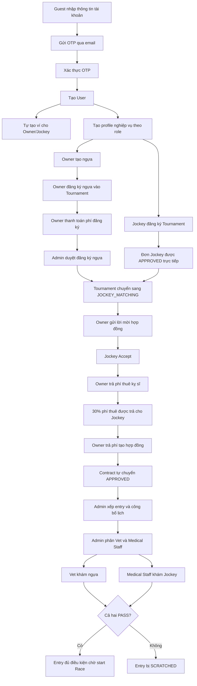

# Tài liệu demo kỹ thuật — Tài khoản, đăng ký giải, hợp đồng và khám sức khỏe

> Ngày đối chiếu source: 28/07/2026  
> Phạm vi: Backend `HorseRacing-BE` và Frontend `HorseRacing_FE` hiện tại.  
> Tài liệu mô tả code đang chạy, không mô tả lại các nghiệp vụ cũ đã bị bỏ.

---

## 1. Mục đích tài liệu

Tài liệu này dùng để:

- Chuẩn bị kịch bản demo bốn luồng:
  1. Đăng ký tài khoản.
  2. Đăng ký tham gia giải.
  3. Chủ ngựa lập hợp đồng với kỵ sĩ.
  4. Khám sức khỏe ngựa và kỵ sĩ.
- Biết người demo phải bấm gì trên FE.
- Biết mỗi trang FE đang cần những API nào.
- Hiểu thứ tự Controller → Service → Repository ở BE.
- Biết trạng thái dữ liệu thay đổi như thế nào.
- Chuẩn bị câu trả lời cho những phần giảng viên dễ hỏi.
- Nhận biết các điểm còn chưa đồng nhất trong code hiện tại.

## 2. Quy ước chung

### 2.1. Response API

Các API trả về theo cấu trúc chung:

```json
{
  "code": 200,
  "message": "Success",
  "result": {}
}
```

Khi lỗi, FE cần đọc cả:

- HTTP status.
- `code` nghiệp vụ.
- `message` từ BE.

Không nên chỉ hiện thông báo chung chung như “Internal server error”.

### 2.2. Xác thực

Sau khi đăng nhập, FE gửi JWT:

```http
Authorization: Bearer <access-token>
```

JWT hiện chứa role trong claim `scope`. Những API nghiệp vụ sẽ tiếp tục kiểm tra:

- Role của tài khoản.
- Profile theo role đã tồn tại hay chưa.
- Dữ liệu có thật sự thuộc người đang đăng nhập hay không.
- Trạng thái hiện tại có cho phép thao tác hay không.

### 2.3. Phân biệt “số loại API” và “số request”

Ví dụ một trang dùng bốn endpoint GET và một endpoint POST:

- Số loại API: 5.
- Số request thực tế có thể lớn hơn 5 vì FE refetch lại dữ liệu sau khi POST.

Trong tài liệu sẽ ghi rõ cả hai loại số này.

---

## 3. Tổng quan chuỗi nghiệp vụ



Lưu ý: nếu muốn demo toàn bộ từ đầu đến khám sức khỏe trên cùng một Tournament, Admin vẫn phải thực hiện các bước trung gian:

- Hoàn tất duyệt đăng ký.
- Hoàn tất ghép kỵ sĩ.
- Xác nhận bracket.
- Xếp contract vào race.
- Phân lane.
- Phân trọng tài và nhân sự khám.
- Publish schedule.

Các bước lập lịch không phải trọng tâm của tài liệu này nhưng là điều kiện bắt buộc trước khi Vet và Medical Staff khám.

---

# PHẦN A — ĐĂNG KÝ TÀI KHOẢN

## 4. Mục tiêu nghiệp vụ

Cho phép Guest tự tạo tài khoản thuộc một trong ba role:

- `SPECTATOR`
- `HORSE_OWNER`
- `JOCKEY`

Các role nội bộ như Admin, Referee, Veterinarian và Medical Staff không được tự đăng ký qua form công khai.

## 5. Luồng thao tác trên FE

Trang chính:

```text
HorseRacing_FE/src/pages/auth/Register.jsx
```

Luồng demo:

1. Guest mở trang đăng ký.
2. Nhập họ tên, username, email, password, số điện thoại, ngày sinh, giới tính và role.
3. Bấm đăng ký.
4. FE gọi API gửi OTP.
5. Người dùng lấy OTP trong email và nhập vào giao diện.
6. FE gọi API xác thực OTP.
7. Nếu xác thực thành công, FE tự gọi API đăng nhập.
8. FE lưu JWT và điều hướng người dùng tới portal đúng role.
9. Owner/Jockey tiếp tục tạo profile nghiệp vụ nếu chưa có.

## 6. API của trang đăng ký tài khoản

| Thứ tự | API | Bắt buộc | Mục đích |
|---:|---|:---:|---|
| 1 | `POST /api/auth/register-otp` | Có | Validate dữ liệu và gửi OTP |
| 2 | `POST /api/auth/register/verify` | Có | Xác thực OTP và tạo User |
| 3 | `POST /api/auth/login` | Có trong happy path FE | Đăng nhập tự động sau khi xác thực |
| 4 | `POST /api/auth/register/resend-otp` | Không | Gửi lại OTP |
| 5 | `GET /api/auth/me` | Có trong happy path FE | Hydrate thông tin người đang đăng nhập |
| 6 | `GET /api/owners/me` hoặc `GET /api/jockeys/me` | Có với Owner/Jockey | Kiểm tra profile để chọn trang redirect |

Kết luận:

- Ba API nghiệp vụ cốt lõi của đăng ký là: gửi OTP → xác thực OTP → login.
- FE hiện còn hydrate session bằng `GET /api/auth/me`.
- Với Owner/Jockey, FE gọi thêm API profile để quyết định chuyển đến Dashboard hay trang tạo profile.
- Số request happy path hiện tại:
  - Spectator: khoảng **4 request**.
  - Owner/Jockey: khoảng **5 request**.
  - Gửi lại OTP làm tăng thêm một request.

### Request gửi OTP mẫu

```json
{
  "username": "owner1",
  "password": "Owner@123",
  "email": "owner1@example.com",
  "fullName": "Chủ ngựa 1",
  "phoneNumber": "0912345678",
  "dob": "2000-01-01",
  "gender": "MALE",
  "roleName": "HORSE_OWNER"
}
```

### Request xác thực OTP

```json
{
  "email": "owner1@example.com",
  "otpCode": "123456"
}
```

### Request login

```json
{
  "username": "owner1",
  "password": "Owner@123"
}
```

## 7. Luồng BE và các hàm chính

### 7.1. Gửi OTP

```text
AuthenticationController.registerOtp()
→ UserServiceImpl.requestRegisterOtp()
→ kiểm tra role được tự đăng ký
→ kiểm tra username/email/phone
→ tạo OTP 6 chữ số
→ lưu EmailVerification
→ gửi email OTP
```

OTP hiện có thời hạn 5 phút.

### 7.2. Xác thực OTP và tạo tài khoản

```text
AuthenticationController.verifyRegisterOtp()
→ UserServiceImpl.verifyRegisterOtp()
→ tìm EmailVerification theo email
→ kiểm tra hết hạn
→ so sánh OTP
→ BCrypt password
→ lưu User ACTIVE
→ tạo dữ liệu phụ theo role
→ xóa EmailVerification
```

Dữ liệu phụ được tạo tự động:

| Role | Dữ liệu tự tạo |
|---|---|
| `HORSE_OWNER` | Ví `USER_MAIN` |
| `JOCKEY` | Ví `USER_MAIN` |
| `SPECTATOR` | `Spectator` với `totalPoints = 0` |

Owner và Jockey vẫn phải tạo profile nghiệp vụ riêng:

```http
POST /api/owners/profile
POST /api/jockeys/profile
```

## 8. Validation chính

| Điều kiện | Quy tắc |
|---|---|
| Role | Chỉ `SPECTATOR`, `HORSE_OWNER`, `JOCKEY` |
| Username | Từ 4 đến 15 ký tự |
| Password | Từ 8 đến 255 ký tự |
| Email | Đúng định dạng, tối đa 100 ký tự |
| Số điện thoại | Dạng số điện thoại Việt Nam, 10 chữ số |
| Ngày sinh | Phải trong quá khứ và đủ 18 tuổi |
| Username/email/phone | Không được trùng |
| OTP | Phải tồn tại, chưa hết hạn và khớp hoàn toàn |

Một số error code quan trọng:

| Code | Ý nghĩa |
|---:|---|
| 1102 | User đã tồn tại |
| 1103 | Email đã tồn tại |
| 1112 | Số điện thoại đã tồn tại |
| 1110 | Role không được tự đăng ký |
| 1113 | Không tìm thấy yêu cầu xác thực email |
| 1114 | OTP hết hạn |
| 1115 | OTP không đúng |
| 1117 | Username đang nằm trong một yêu cầu OTP khác |
| 1201 | Chưa có Owner profile |
| 1202 | Chưa có Jockey profile |

## 9. Những câu dễ bị hỏi

### Tại sao không tạo User ngay khi bấm đăng ký?

Để tránh tạo tài khoản rác bằng email không sở hữu. User chỉ được lưu chính thức sau khi OTP hợp lệ.

### Vì sao Owner/Jockey có ví ngay nhưng vẫn phải tạo profile?

`User` quản lý xác thực và phân quyền. `Owner`/`Jockey` chứa thông tin nghiệp vụ riêng. Ví được tạo sớm để tài khoản có thể nhận/nạp tiền, còn profile nghiệp vụ cần người dùng bổ sung thông tin.

### Spectator có cần tạo profile bằng API riêng không?

Không. Code hiện tự tạo `Spectator` khi OTP được xác thực.

### Password được lưu như thế nào?

Password được BCrypt trước khi lưu, không lưu plain text.

### Điểm cần chú ý khi bị hỏi sâu

Trong `AuthServiceImpl`, cần kiểm tra lại việc login có chặn đầy đủ tài khoản không ở trạng thái `ACTIVE` hay không. Đây là câu hỏi bảo mật dễ gặp.

---

# PHẦN B — ĐĂNG KÝ THAM GIA GIẢI

## 10. Có hai luồng đăng ký khác nhau

| Người đăng ký | Có hóa đơn đăng ký | Có Admin duyệt |
|---|:---:|:---:|
| Owner đăng ký ngựa | Có | Có |
| Jockey đăng ký bản thân | Không | Không trong code hiện tại |

Không nên trình bày rằng Admin còn duyệt đơn Jockey. Source hiện tại tạo đơn Jockey ở trạng thái `APPROVED` ngay khi đăng ký hợp lệ.

---

## 11. Owner đăng ký ngựa vào giải

### 11.1. Trang FE

```text
HorseRacing_FE/src/pages/owner/OwnerTournaments.jsx
```

### 11.2. Luồng người dùng

1. Owner đã có profile.
2. Owner đã tạo ít nhất một Horse.
3. Owner mở trang giải đấu.
4. FE tải giải, ngựa, đơn đã đăng ký và hóa đơn.
5. Owner chọn Tournament.
6. FE tải chi tiết và điều kiện của Tournament.
7. Owner chọn một Horse đủ điều kiện.
8. FE tạo registration.
9. BE tạo registration `PENDING_PAYMENT` và hóa đơn phí đăng ký.
10. Owner thanh toán hóa đơn.
11. Registration chuyển `PENDING_REVIEW`.
12. Admin duyệt.
13. Registration chuyển `APPROVED`.

### 11.3. API của trang Owner đăng ký giải

| STT | API | Vai trò |
|---:|---|---|
| 1 | `GET /api/tournaments` | Lấy danh sách giải |
| 2 | `GET /api/tournaments/{tournamentId}` | Lấy chi tiết và điều kiện giải |
| 3 | `GET /api/tournaments/{tournamentId}/prizes` | Lấy cơ cấu giải thưởng trong modal chi tiết |
| 4 | `GET /api/tournaments/{tournamentId}/eligibility` | Lấy điều kiện tham gia |
| 5 | `GET /api/horses/my-horses` | Lấy ngựa thuộc Owner |
| 6 | `GET /api/owners/my-registrations` | Lấy trạng thái các đơn |
| 7 | `GET /api/invoices/my-invoices` | Tìm hóa đơn của registration |
| 8 | `POST /api/owners/tournaments/{tournamentId}/register-horse` | Tạo đơn |
| 9 | `POST /api/invoices/{invoiceId}/pay` | Thanh toán hóa đơn |

Kết luận:

- Trang này dùng **9 loại API** cho luồng chính.
- `getTournamentDetails()` là helper gọi song song ba endpoint: tournament, prizes và eligibility.
- Theo cách refetch hiện tại, happy path từ lúc mới mở trang đến thanh toán có thể tạo **17 request**:

```text
Mở trang:                     4 GET
Mở chi tiết Tournament:       3 GET
Tạo registration:             1 POST
Refetch sau tạo:               4 GET
Thanh toán:                    1 POST
Refetch sau thanh toán:        4 GET
Tổng:                         17 request
```

Con số 17 không có nghĩa BE cần 17 endpoint; chỉ có 9 loại endpoint, các GET được gọi lại để đồng bộ state.

### 11.4. Request đăng ký ngựa

```json
{
  "horseId": "uuid-cua-horse"
}
```

### 11.5. Luồng BE

```text
OwnerController.registerHorse()
→ TournamentRegistrationServiceImpl.registerHorse()
→ tìm Tournament
→ kiểm tra status và phase
→ tìm Owner profile hiện tại
→ tìm Horse và kiểm tra ownership
→ kiểm tra duplicate/conflict
→ kiểm tra sức khỏe, tuổi, rating và eligibility
→ lưu TournamentRegistration PENDING_PAYMENT
→ tạo Invoice phí đăng ký
```

Khi trả hóa đơn:

```text
InvoiceController.pay()
→ InvoiceService/PaymentService
→ lock hóa đơn và ví
→ trừ Owner USER_MAIN
→ cộng SYSTEM_REVENUE
→ đánh dấu Invoice PAID
→ InvoicePaymentCompleteServiceImpl
→ RegistrationPaymentService.markOwnerRegistrationPaid()
→ Registration PENDING_PAYMENT → PENDING_REVIEW
```

Khi Admin duyệt:

```text
POST /api/admin/horse-registrations/{registrationId}/approve
→ kiểm tra đang PENDING_REVIEW
→ kiểm tra chưa vượt maxApprovedEntries
→ Registration → APPROVED
```

### 11.6. Validation chính

- Tournament phải có status `OPEN`.
- Tournament phải ở phase `REGISTRATION_OPEN`.
- Horse phải tồn tại và thuộc Owner hiện tại.
- Horse không được đăng ký trùng trong cùng Tournament.
- Horse không được có registration đang hoạt động ở một Tournament trùng thời gian.
- Horse phải `HEALTHY`.
- Tuổi Horse phải nằm trong khoảng của Tournament.
- Rating/RaceClass phải phù hợp.
- Tất cả điều kiện eligibility đang active phải đạt.
- Owner phải đủ số dư để thanh toán.
- Chỉ registration đã thanh toán mới được Admin duyệt.
- Số registration được duyệt không vượt `maxApprovedEntries`.

Error code thường gặp:

| Code | Ý nghĩa |
|---:|---|
| 1302 | Horse không thuộc Owner |
| 1303 | Horse không đủ điều kiện |
| 1304 | Trạng thái sức khỏe Horse không hợp lệ |
| 1403 | Ví không đủ tiền |
| 1409 | Không tìm thấy hóa đơn |
| 1410 | Hóa đơn đã thanh toán |
| 1423 | Hóa đơn hết hạn |
| 1502 | Tournament chưa mở |
| 1510 | Horse đã đăng ký Tournament |
| 1532 | Trạng thái registration không hợp lệ |
| 1535 | Horse bị trùng lịch giữa các Tournament |
| 1579 | Đã đạt giới hạn số registration được duyệt |

### 11.7. Rút đăng ký

Owner có thể gọi:

```http
POST /api/owners/registrations/{registrationId}/withdraw
```

Body:

```json
{
  "reason": "Không thể tiếp tục tham gia"
}
```

Code cho phép rút ở một số trạng thái và phase sớm. Nếu đã có contract tiến sâu đến bước thanh toán/active thì bị chặn.

Điểm dễ bị hỏi: method rút đăng ký hiện không thể hiện rõ việc tự refund phí đăng ký đã thanh toán. Khi demo không nên khẳng định “Owner rút là luôn được hoàn phí” nếu chưa bổ sung policy này.

---

## 12. Jockey đăng ký giải

### 12.1. Trang FE

```text
HorseRacing_FE/src/pages/jockey/JockeyTournaments.jsx
```

### 12.2. Luồng

1. Jockey đã tạo Jockey profile.
2. Jockey mở trang giải đấu.
3. FE tải danh sách giải, đơn của Jockey và profile.
4. Jockey xem chi tiết Tournament.
5. FE tải chi tiết giải và danh sách ngựa đã được chấp nhận.
6. Jockey nhập mức phí thuê mong muốn.
7. Jockey xác nhận đăng ký.
8. BE validate và tạo registration `APPROVED`.
9. Jockey xuất hiện trong danh sách để Owner mời.

### 12.3. API

| STT | API | Vai trò |
|---:|---|---|
| 1 | `GET /api/tournaments` | Danh sách Tournament |
| 2 | `GET /api/tournaments/{id}` | Chi tiết Tournament |
| 3 | `GET /api/tournaments/{id}/prizes` | Cơ cấu giải thưởng |
| 4 | `GET /api/tournaments/{id}/eligibility` | Điều kiện tham gia |
| 5 | `GET /api/jockey/my-registrations` | Registration của Jockey |
| 6 | `GET /api/jockeys/me` | Jockey profile |
| 7 | `GET /api/jockey/tournaments/{id}/accepted-horses` | Ngựa đã được duyệt |
| 8 | `POST /api/jockey/tournaments/{id}/register` | Đăng ký Tournament |

Kết luận:

- Trang dùng **8 loại API**.
- `getTournamentDetails()` gọi ba endpoint chi tiết giải; nó chạy song song với endpoint accepted horses.
- Happy path theo FE hiện tại có khoảng **11 request**:

```text
Mở trang:                  3 GET
Mở chi tiết:               4 GET
Đăng ký:                   1 POST
Refetch sau đăng ký:        3 GET
Tổng:                      11 request
```

Request:

```json
{
  "hireFee": 5000000
}
```

### 12.4. Luồng BE

```text
JockeyTournamentController.register()
→ TournamentRegistrationServiceImpl.registerJockey()
→ kiểm tra Tournament OPEN + REGISTRATION_OPEN
→ tìm Jockey profile
→ kiểm tra duplicate và trùng thời gian
→ kiểm tra Jockey AVAILABLE
→ kiểm tra eligibility
→ lưu JockeyTournamentRegistration APPROVED
→ gửi notification
```

### 12.5. Điểm dễ bị hỏi

#### Tại sao Jockey không cần Admin duyệt?

Đây là nghiệp vụ hiện tại trong source: Jockey đăng ký hợp lệ thì được `APPROVED` trực tiếp. Admin vẫn duyệt registration của Horse.

#### `hireFee` là gì?

Đây là mức phí Jockey muốn được thuê trong Tournament. Khi Owner gửi lời mời, contract lấy mức phí từ registration của Jockey.

#### Có thể nhập `hireFee = 0` không?

Đây là một điểm chưa đồng nhất:

- DTO đăng ký Jockey hiện cho phép `hireFee >= 0`.
- Khi tạo contract, BE yêu cầu hire fee phải lớn hơn 0.

Để demo không vướng lỗi, luôn nhập số tiền lớn hơn 0. Về lâu dài nên đồng bộ validation thành `hireFee > 0` ngay từ lúc Jockey đăng ký.

---

# PHẦN C — LẬP HỢP ĐỒNG OWNER–JOCKEY

## 13. Điều kiện trước khi lập hợp đồng

- Tournament đang ở phase `JOCKEY_MATCHING`.
- Horse registration của Owner là `APPROVED`.
- Jockey registration là `APPROVED`.
- Horse và Jockey thuộc cùng Tournament.
- Horse chưa bị giữ chỗ bởi contract hợp lệ khác.
- Jockey chưa bị giữ chỗ bởi contract hợp lệ khác trong Tournament.
- `hireFee > 0`.

## 14. Phân biệt hai tỷ lệ 30/70 và 70/30

Đây là phần rất dễ bị hỏi.

| Tỷ lệ | Áp dụng cho | Ý nghĩa |
|---|---|---|
| 30% / 70% | Phí thuê Jockey | Trả trước 30% khi hợp đồng active; giữ 70% trong escrow đến khi hoàn thành Final |
| 70% / 30% | Tiền thưởng chung cuộc | Owner nhận 70%, Jockey nhận 30% trong cấu hình FE hiện tại |

Hai tỷ lệ này là hai loại tiền hoàn toàn khác nhau.

### Trạng thái enforce hiện tại

- BE cố định `advancePercent = 30`, `finalPercent = 70` cho phí thuê.
- FE cố định prize share Owner 70%, Jockey 30% và không cho người dùng chỉnh.
- BE hiện mới validate hai prize share nằm trong khoảng 0–100 và tổng bằng 100.

Do đó, client tự viết vẫn có thể gửi prize share khác 70/30. Nếu nghiệp vụ yêu cầu 70/30 tuyệt đối, BE cũng nên khóa cứng hai giá trị này.

## 15. Đây không phải một trang duy nhất

Luồng hợp đồng hoàn chỉnh đi qua ba màn hình:

1. Owner tìm và mời Jockey.
2. Jockey xem lời mời và Accept/Reject.
3. Owner xem chi tiết hợp đồng và thanh toán hai hóa đơn.

### 15.1. Trang Owner tìm và mời Jockey

File:

```text
HorseRacing_FE/src/pages/owner/JockeySearchPage.jsx
```

API:

| STT | API | Vai trò |
|---:|---|---|
| 1 | `GET /api/owners/my-registrations` | Lấy Horse registration APPROVED |
| 2 | `GET /api/tournaments` | Lọc Tournament đang JOCKEY_MATCHING |
| 3 | `GET /api/owner/contracts` | Loại Horse đã được giữ chỗ |
| 4 | `GET /api/owners/tournaments/{id}/accepted-jockeys` | Danh sách Jockey khả dụng |
| 5 | `POST /api/owner/contracts/invite` | Gửi lời mời |

Kết luận:

- Riêng trang “Thuê kỵ sĩ” cần **5 loại API**.
- Lần mở đầu và gửi lời mời thường cần **5 request**.

Request invite:

```json
{
  "tournamentRegistrationId": "uuid-don-ngua",
  "jockeyTournamentRegistrationId": "uuid-don-jockey",
  "ownerPrizeSharePercent": 70,
  "jockeyPrizeSharePercent": 30,
  "contractNote": "Điều khoản bổ sung nếu có"
}
```

### 15.2. Trang Jockey xử lý lời mời

API:

| API | Vai trò |
|---|---|
| `GET /api/jockey/contracts/invitations` | Lời mời đang chờ |
| `GET /api/jockey/contracts` | Toàn bộ contract của Jockey |
| `POST /api/jockey/contracts/{id}/accept` | Chấp nhận |
| `POST /api/jockey/contracts/{id}/reject` | Từ chối |
| `POST /api/jockey/contracts/{id}/cancel` | Hủy sau Accept nhưng trước khi Owner trả tiền |

Happy path Accept dùng **3 loại API chính**:

1. GET invitations.
2. GET contracts.
3. POST accept.

FE thường refetch hai GET sau action nên có khoảng **5 request**.

### 15.3. Trang Owner thanh toán hợp đồng

API FE đang dùng:

| API | Vai trò |
|---|---|
| `GET /api/owner/contracts/{id}` | Chi tiết và trạng thái contract |
| `GET /api/invoices/my-invoices` | Tìm hai hóa đơn của contract |
| `POST /api/invoices/{invoiceId}/pay` | Thanh toán hóa đơn |
| `GET /api/wallets/my-wallet` | Cập nhật số dư |
| `GET /api/transactions/my-transactions` | Cập nhật lịch sử giao dịch |

Trang này dùng **5 loại API** trong happy path.

Với hai lần thanh toán và cách refetch hiện tại, số request có thể khoảng:

```text
Mở trang:                              2 GET
Thanh toán phí thuê + refetch:         5 request
Thanh toán phí tạo hợp đồng + refetch: 5 request
Tổng:                                 12 request
```

BE vẫn có hai endpoint chuyên biệt:

```http
POST /api/contracts/{id}/pay-hiring-fee
POST /api/contracts/{id}/pay-contract-fee
```

Tuy nhiên FE hiện dùng luồng hóa đơn chung:

```http
POST /api/invoices/{invoiceId}/pay
```

Khi demo nên dùng đúng luồng FE đang dùng, không trộn hai cách thanh toán trong cùng một contract.

### 15.4. Tổng số API của toàn bộ hành trình hợp đồng

Nếu tính toàn bộ ba màn hình và bỏ các endpoint trùng nhau, happy path cần khoảng **13 mẫu endpoint**.

Không nên trả lời rằng “trang lập hợp đồng cần 13 API”. Câu trả lời chính xác là:

- Trang Owner tìm Jockey: 5 API.
- Trang Jockey xử lý lời mời: 3 API chính.
- Trang Owner thanh toán: 5 API.
- Toàn bộ journey nhiều role: khoảng 13 mẫu endpoint sau khi tính các URL khác nhau.

## 16. Luồng BE chi tiết

### 16.1. Owner gửi lời mời

```text
OwnerContractController.invite()
→ ContractServiceImpl.inviteJockey()
→ lock Horse registration
→ lock Jockey registration
→ kiểm tra ownership
→ kiểm tra cùng Tournament
→ kiểm tra cả hai APPROVED
→ kiểm tra Tournament JOCKEY_MATCHING
→ kiểm tra Horse/Jockey chưa bị giữ chỗ
→ kiểm tra hire fee và prize share
→ lưu Contract PENDING_JOCKEY
→ gửi notification cho Jockey
```

### 16.2. Jockey Accept

```text
JockeyContractController.accept()
→ ContractServiceImpl.acceptContract()
→ kiểm tra contract thuộc Jockey hiện tại
→ chỉ cho PENDING_JOCKEY
→ kiểm tra registration vẫn APPROVED
→ kiểm tra Horse và Jockey vẫn khả dụng
→ Contract → ACCEPTED
→ hủy các lời mời PENDING_JOCKEY cạnh tranh
→ tạo Invoice JOCKEY_HIRING_FEE cho Owner
```

Sau Accept:

- Cùng Horse không thể Accept Jockey khác.
- Cùng Jockey không thể được ghép với Horse khác trong cùng Tournament.
- Các lựa chọn đã được giữ chỗ phải biến mất khỏi danh sách FE.

### 16.3. Owner trả phí thuê

```text
Owner thanh toán Invoice JOCKEY_HIRING_FEE
→ trừ Owner USER_MAIN
→ cộng SYSTEM_ESCROW
→ Invoice PAID
→ ContractPaymentService.markHiringFeePaid()
→ escrowStatus = HELD
→ Contract = HIRING_PAID
→ tạo Invoice CONTRACT_CREATION_FEE
```

### 16.4. Owner trả phí tạo hợp đồng

```text
Owner thanh toán Invoice CONTRACT_CREATION_FEE
→ trừ Owner USER_MAIN
→ cộng SYSTEM_REVENUE
→ Invoice PAID
→ ContractPaymentService.activateAfterFullPayment()
→ kiểm tra cả hai hóa đơn PAID
→ kiểm tra escrow đang HELD
→ SYSTEM_ESCROW trả 30% hireFee cho Jockey
→ giữ lại 70% trong SYSTEM_ESCROW
→ Contract = APPROVED
→ escrowStatus = PARTIALLY_RELEASED
```

`APPROVED` ở đây là tên trạng thái lịch sử. Theo nghiệp vụ hiện tại:

- Không có bước Admin duyệt contract.
- Contract tự active sau khi Owner trả đủ phí thuê và phí tạo hợp đồng.

70% phí thuê còn lại chỉ được release sau khi Final Race Report được publish theo luồng payout cuối giải.

## 17. Dòng tiền hợp đồng

Ví dụ:

```text
Hire fee:             10.000.000 VND
Contract creation fee:   500.000 VND
```

| Bước | Ví trừ | Ví cộng | Số tiền |
|---|---|---|---:|
| Trả phí thuê | Owner `USER_MAIN` | `SYSTEM_ESCROW` | 10.000.000 |
| Active contract | `SYSTEM_ESCROW` | Jockey `USER_MAIN` | 3.000.000 |
| Giữ đến Final | Nằm trong `SYSTEM_ESCROW` | Chưa chuyển | 7.000.000 |
| Trả phí tạo hợp đồng | Owner `USER_MAIN` | `SYSTEM_REVENUE` | 500.000 |

Phải nói đúng thứ tự:

```text
Owner trả phí thuê
→ tiền phí thuê vào Escrow
→ Owner trả phí tạo hợp đồng
→ khi đủ cả hai khoản, 30% phí thuê mới chuyển cho Jockey
```

## 18. Validation và error code hợp đồng

| Code | Ý nghĩa |
|---:|---|
| 1546 | Không tìm thấy contract |
| 1547 | Trạng thái contract không cho phép thao tác |
| 1572 | Horse đã có contract trong Tournament |
| 1601 | Hai registration không cùng Tournament |
| 1602 | Hire fee không hợp lệ |
| 1603 | Prize share không hợp lệ hoặc tổng khác 100 |
| 1604 | Contract đã tồn tại |
| 1605 | Chưa thanh toán hiring fee |
| 1606 | Escrow status không hợp lệ |
| 1610 | Không được phép hủy contract ở trạng thái hiện tại |
| 1613 | Jockey đã có contract trong Tournament |

Quy tắc Reject/Cancel:

- Jockey chỉ Reject khi contract là `PENDING_JOCKEY`.
- Jockey chỉ Cancel sau Accept khi Owner chưa thanh toán hiring fee và escrow chưa giữ tiền.
- Sau khi đã có tiền, không được dùng Reject để đổi contract sang `REJECTED`.
- Các trạng thái sau thanh toán phải đi theo cancellation/refund policy riêng.

## 19. Những câu dễ bị hỏi

### Admin duyệt hợp đồng ở đâu?

Không còn bước đó. Sau hai khoản thanh toán hợp lệ, contract tự chuyển `APPROVED`.

### Vì sao status vẫn tên `APPROVED`?

Đây là tên enum cũ được giữ để tương thích dữ liệu/code. Về nghiệp vụ hiện tại nó mang nghĩa “đã kích hoạt đầy đủ”, không phải “vừa được Admin duyệt”.

### Tại sao phí thuê vào Escrow nhưng phí tạo hợp đồng vào Revenue?

- Phí thuê thuộc về Jockey nhưng được giữ để bảo đảm thực hiện hợp đồng.
- Phí tạo hợp đồng là phí dịch vụ của hệ thống nên vào doanh thu.

### Làm sao ngăn một Jockey ký với hai Horse trong cùng giải?

BE kiểm tra registration/contract đang giữ chỗ, khóa dữ liệu khi thao tác và khi Accept sẽ hủy các invitation cạnh tranh. FE cũng lọc Jockey/Horse đã bị giữ chỗ để không cho chọn lại.

### Nếu bấm thanh toán hai lần?

BE kiểm tra trạng thái Invoice và Transaction. Hóa đơn đã `PAID` không được thanh toán lại.

### Điểm còn cần siết chặt

- FE đã khóa prize share 70/30 nhưng BE chưa bắt buộc đúng 70/30.
- DTO đăng ký Jockey cho `hireFee = 0`, nhưng contract yêu cầu `hireFee > 0`.
- Tên status `APPROVED` dễ làm người đọc hiểu nhầm còn Admin review.

---

# PHẦN D — KHÁM SỨC KHỎE NGỰA VÀ JOCKEY

## 20. Điều kiện trước khi khám

Để phiếu khám xuất hiện và submit được:

- Race đã có entries.
- Race đã được publish schedule và có status `SCHEDULED`.
- Admin đã phân đúng Veterinarian và Medical Staff cho Race.
- Race chưa bắt đầu.
- Thời gian hiện tại nằm trong inspection window:

```text
inspectionOpenAt
<= now
<= inspectionCloseAt
```

Theo cấu hình thông thường:

```text
inspectionOpenAt  = race.startTime - inspectionOpenMinutesBefore
inspectionCloseAt = race.startTime - inspectionCloseMinutesBefore
```

## 21. Admin phân nhân sự khám

API hỗ trợ:

| API | Mục đích |
|---|---|
| `GET /api/veterinarians` | Danh sách Vet |
| `GET /api/medical-staff` | Danh sách Medical Staff |
| `POST /api/admin/races/{raceId}/inspection-staff/assign` | Phân thủ công |
| `POST /api/admin/races/{raceId}/inspection-staff/auto-assign` | Phân tự động |

Request phân thủ công:

```json
{
  "veterinarianId": "uuid-vet",
  "medStaffId": "uuid-medical"
}
```

Riêng khối phân công thủ công cần **3 loại API**:

1. GET Vet.
2. GET Medical Staff.
3. POST assign.

Không tính các API tải Tournament/Round/Race của cả Scheduling Board.

### Validation phân nhân sự

- Race chỉ được assign khi `SCHEDULING` hoặc `SCHEDULED`.
- Nếu đã `SCHEDULED`, phải assign trước lúc mở inspection.
- Không được đổi nhân sự khi Race đã có inspection.
- Staff không được `SUSPENDED`.
- Staff phải đang `AVAILABLE`.
- BE lock Race và Staff khi assign để tránh hai Race lấy cùng một người đồng thời.
- Staff được chọn chuyển sang `ASSIGNED`.

## 22. Trang Vet khám ngựa

### API

| API | Vai trò |
|---|---|
| `GET /api/vet/races/assigned?page=0&size=100` | Race và entries được giao |
| `GET /api/vet/race-entries/{entryId}/horse-inspection` | Xem phiếu đã khám |
| `POST /api/vet/race-entries/{entryId}/horse-inspection` | Nộp phiếu khám |

Trang Vet cần **3 loại API**.

Happy path khám mới thường có:

```text
GET danh sách được giao
GET/refetch race được giao khi mở chi tiết
POST phiếu khám
≈ 3 request
```

### Request mẫu PASS

```json
{
  "result": "PASS",
  "note": "Ngựa đủ điều kiện thi đấu",
  "handicapConfirmed": true,
  "actualWeight": 480.5,
  "actualBreed": "THOROUGHBRED",
  "dopingDetected": false
}
```

Các dữ liệu cần hiển thị để Vet đối chiếu:

- Cân nặng đăng ký.
- Cân nặng thực tế.
- Giống ngựa trên hồ sơ.
- Giống ngựa thực tế.
- Có phát hiện doping hay không.
- Điều kiện của Tournament.
- Thông tin handicap nếu Tournament có bật handicap.

`handicapWeight` có trong DTO cũ nhưng Service không tin số do client tự nhập. BE tự tính ballast/handicap theo dữ liệu Tournament và Race.

## 23. Trang Medical Staff khám Jockey

### API

| API | Vai trò |
|---|---|
| `GET /api/medical/races/assigned?page=0&size=100` | Race và entries được giao |
| `GET /api/medical/race-entries/{entryId}/jockey-inspection` | Xem phiếu đã khám |
| `POST /api/medical/race-entries/{entryId}/jockey-inspection` | Nộp phiếu khám |

Trang Medical Staff cần **3 loại API**.

Request mẫu PASS:

```json
{
  "result": "PASS",
  "note": "Kỵ sĩ đủ điều kiện thi đấu",
  "actualWeight": 53.2,
  "dopingDetected": false
}
```

Các dữ liệu cần hiển thị:

- Cân nặng đăng ký của Jockey.
- Cân nặng thực tế.
- Có phát hiện doping hay không.
- Điều kiện cân nặng của Tournament.
- Thông tin handicap chỉ hiện nếu Tournament bật handicap.

## 24. Luồng BE khi submit inspection

### 24.1. Horse inspection

```text
VetInspectionController.createHorseInspection()
→ HorseInspectionServiceImpl
→ tìm và lock RaceEntry/Race
→ kiểm tra race SCHEDULED
→ kiểm tra entry CONFIRMED
→ kiểm tra current user là Vet được assign
→ kiểm tra inspection window
→ kiểm tra chưa có HorseInspection
→ kiểm tra cân nặng, giống, doping, handicap
→ lưu HorseInspection CONFIRMED
→ nếu FAIL: RaceEntry → SCRATCHED
```

### 24.2. Jockey inspection

```text
MedicalInspectionController.createJockeyInspection()
→ JockeyInspectionServiceImpl
→ tìm và lock RaceEntry/Race
→ kiểm tra race SCHEDULED
→ kiểm tra entry CONFIRMED
→ kiểm tra current user là Medical Staff được assign
→ kiểm tra inspection window
→ kiểm tra chưa có JockeyInspection
→ kiểm tra cân nặng và doping
→ lưu JockeyInspection CONFIRMED
→ nếu FAIL: RaceEntry → SCRATCHED
```

## 25. Quy tắc PASS/FAIL

### Horse

- Có doping → bắt buộc `FAIL`.
- Giống thực tế khác giống hồ sơ → bắt buộc `FAIL`.
- Tournament bật handicap, Horse muốn `PASS` → phải xác nhận handicap.
- Kết quả `FAIL` → entry bị `SCRATCHED`.

### Jockey

- Có doping → bắt buộc `FAIL`.
- Kết quả `FAIL` → entry bị `SCRATCHED`.

### Quan hệ giữa hai phiếu

Để được start Race:

```text
Horse inspection = CONFIRMED + PASS
AND
Jockey inspection = CONFIRMED + PASS
```

Chỉ một bên `FAIL` là đủ làm entry `SCRATCHED`.

Sau khi entry đã `SCRATCHED`, bên còn lại không tiếp tục khám như một entry active. Đây là lý do có thể gặp:

- `JOCKEY_INSPECTION_FAILED`
- `HORSE_INSPECTION_FAILED`
- `RACE_ENTRY_NOT_ACTIVE`

## 26. Error code inspection thường gặp

| Code | Ý nghĩa |
|---:|---|
| 1708 | Horse inspection đã tồn tại |
| 1709 | Jockey inspection đã tồn tại |
| 1710 | Vet không được assign vào Race |
| 1711 | Medical Staff không được assign vào Race |
| 1712 | Race không ở trạng thái SCHEDULED |
| 1717 | Chưa xác nhận handicap |
| 1723 | Dữ liệu khám Horse bắt buộc phải FAIL |
| 1724 | Dữ liệu khám Jockey bắt buộc phải FAIL |
| 1807 | Chưa đến giờ mở khám |
| 1808 | Đã hết giờ khám |
| 1809 | Entry không còn active |
| 1814 | Jockey inspection đã FAIL |
| 1815 | Horse inspection đã FAIL |

## 27. Những câu dễ bị hỏi

### Tại sao phiếu khám không cho sửa?

Code hiện coi inspection đã xác nhận là hồ sơ nghiệp vụ một lần. Duplicate inspection bị chặn bằng error 1708/1709. Nếu cần sửa phải thiết kế amendment/audit trail riêng, không ghi đè im lặng.

### Tại sao một bên FAIL thì bên kia không khám tiếp?

Entry đã chắc chắn không được thi đấu và chuyển `SCRATCHED`; hệ thống không tiếp tục xử lý nó như entry active.

### Nếu muốn demo cả hai phiếu thì làm thế nào?

Với entry dùng để demo full flow:

1. Vet chọn PASS.
2. Medical Staff chọn PASS.

Nếu muốn demo FAIL, dùng một entry khác và thực hiện phiếu muốn minh họa trước. Sau khi một bên FAIL, không kỳ vọng bên còn lại tiếp tục submit thành công.

### Ai quyết định handicap weight?

BE tính; Vet chỉ xác nhận. Cách này ngăn client tự gửi một trọng lượng handicap có lợi cho entry.

### Hết giờ khám mà chưa đủ phiếu thì sao?

Deadline finalizer/lazy finalize sẽ scratch entry thiếu inspection hợp lệ. Race start chỉ chấp nhận entry active đã có cả hai kết quả PASS.

### Vì sao FE có thể hiển thị “SUBMITTED” nhưng BE lưu “CONFIRMED”?

Đây là khác biệt nhỏ giữa cách đặt nhãn UI và state thực tế. BE hiện xác nhận ngay khi tạo phiếu, không có bước review inspection trung gian.

---

# PHẦN E — KỊCH BẢN DEMO ĐỀ XUẤT

## 28. Chuẩn bị dữ liệu

Nên có sẵn:

- 1 tài khoản Admin.
- 1 Owner mới để demo đăng ký tài khoản.
- 1 Jockey mới để demo đăng ký tài khoản.
- 1 Owner đã có profile, Horse và đủ tiền.
- 1 Jockey đã có profile và status `AVAILABLE`.
- System wallets:
  - `SYSTEM_REVENUE`
  - `SYSTEM_ESCROW`
  - `SYSTEM_PRIZE_POOL`
- 1 Tournament đang `OPEN` + `REGISTRATION_OPEN`.
- 1 Tournament hoặc cùng Tournament sau khi chuyển phase sang `JOCKEY_MATCHING`.
- 1 Race `SCHEDULED` có inspection window đang mở.
- 1 Vet và 1 Medical Staff đã được assign vào Race.

## 29. Cách demo ít rủi ro nhất

Nên chuẩn bị ba Tournament/dataset riêng:

1. `DEMO REGISTRATION`
   - Đang `REGISTRATION_OPEN`.
   - Dùng cho Owner/Jockey đăng ký.
2. `DEMO CONTRACT`
   - Đang `JOCKEY_MATCHING`.
   - Có registration APPROVED sẵn.
3. `DEMO INSPECTION`
   - Race đã `SCHEDULED`.
   - Inspection window đang mở.
   - Có entries và nhân sự đã assign.

Lý do: một Tournament thật không thể cùng lúc ở cả ba phase. Tách dataset giúp demo không phải đợi hoặc thao tác quá nhiều bước Admin ở giữa.

## 30. Script demo 15–20 phút

### Phần 1 — Tài khoản

1. Mở trang Register.
2. Đăng ký một `HORSE_OWNER`.
3. Mở email, lấy OTP.
4. Xác thực OTP.
5. Chỉ ra FE tự login và ví đã được tạo.
6. Tạo Owner profile.

Điểm cần nói:

- User chưa được tạo chính thức trước OTP.
- Role self-register bị giới hạn.
- Password BCrypt.
- Owner/Jockey được tự tạo ví.

### Phần 2 — Đăng ký giải

1. Đăng nhập Owner đã có Horse.
2. Mở “Giải đấu”.
3. Chọn Tournament.
4. Chỉ ra điều kiện tham gia.
5. Chọn Horse và đăng ký.
6. Chỉ ra registration `PENDING_PAYMENT`.
7. Thanh toán hóa đơn.
8. Chỉ ra registration `PENDING_REVIEW`.
9. Đăng nhập Admin và approve.
10. Chỉ ra registration `APPROVED`.
11. Đăng nhập Jockey, nhập hire fee và đăng ký.
12. Chỉ ra Jockey registration được `APPROVED` trực tiếp.

Điểm cần nói:

- Owner có phí và Admin review.
- Jockey hiện không có Admin review.
- Horse được kiểm tra ownership, health, age, rating, eligibility và conflict.

### Phần 3 — Hợp đồng

1. Dùng Tournament `JOCKEY_MATCHING`.
2. Owner mở “Thuê kỵ sĩ”.
3. Chọn Horse và Jockey.
4. Chỉ ra prize share cố định Owner 70% / Jockey 30%.
5. Gửi invitation.
6. Đăng nhập Jockey.
7. Accept invitation.
8. Đăng nhập Owner.
9. Thanh toán phí thuê.
10. Chỉ ra phí thuê vào Escrow.
11. Thanh toán phí tạo hợp đồng.
12. Chỉ ra:
    - Contract tự `APPROVED`.
    - 30% hire fee sang ví Jockey.
    - 70% còn ở Escrow.
    - Phí tạo hợp đồng vào Revenue.

Điểm cần nói:

- Không còn Admin duyệt hợp đồng.
- Jockey/Horse không được ghép trùng trong cùng giải.
- Có hai hóa đơn và hai mục đích tiền khác nhau.

### Phần 4 — Inspection

1. Admin mở Scheduling Board.
2. Chọn Race.
3. Assign một Vet và một Medical Staff.
4. Đăng nhập Vet.
5. Mở race được giao.
6. Chọn entry và submit Horse PASS.
7. Đăng nhập Medical Staff.
8. Submit Jockey PASS cùng entry.
9. Đăng nhập Referee hoặc mở readiness để chỉ ra entry đủ điều kiện.
10. Dùng entry khác để demo FAIL/doping nếu cần.
11. Chỉ ra entry FAIL chuyển `SCRATCHED`.

Điểm cần nói:

- Đúng người được assign mới khám được.
- Chỉ khám trong window.
- Phiếu đã xác nhận không tạo lại.
- Một bên FAIL là entry bị loại trước cuộc đua.

---

# PHẦN F — CHECKLIST TRƯỚC KHI DEMO

## 31. Tài khoản

- [ ] Email gửi OTP hoạt động.
- [ ] Username từ 4–15 ký tự.
- [ ] Password ít nhất 8 ký tự.
- [ ] Số điện thoại không trùng.
- [ ] Tài khoản đủ 18 tuổi.
- [ ] Owner/Jockey profile đã có cho các tài khoản seed.

## 32. Đăng ký giải

- [ ] Tournament `OPEN`.
- [ ] Phase `REGISTRATION_OPEN`.
- [ ] Registration deadline chưa qua.
- [ ] Horse thuộc đúng Owner.
- [ ] Horse `HEALTHY`.
- [ ] Horse đạt age/rating/eligibility.
- [ ] Owner wallet đủ tiền.
- [ ] Jockey `AVAILABLE`.
- [ ] Jockey hire fee lớn hơn 0.

## 33. Hợp đồng

- [ ] Tournament `JOCKEY_MATCHING`.
- [ ] Cả hai registration `APPROVED`.
- [ ] Horse/Jockey chưa có contract khác trong Tournament.
- [ ] Owner wallet đủ cả hiring fee và contract creation fee.
- [ ] `SYSTEM_ESCROW` và `SYSTEM_REVENUE` đã tồn tại.
- [ ] Owner prize share/Jockey prize share hiển thị 70/30.

## 34. Inspection

- [ ] Race `SCHEDULED`.
- [ ] `inspectionOpenAt <= now <= inspectionCloseAt`.
- [ ] Entry `CONFIRMED`.
- [ ] Vet/Medical Staff đúng người được assign.
- [ ] Entry chưa có inspection cũ.
- [ ] Nếu demo full flow thì cả hai chọn PASS.
- [ ] Nếu demo FAIL thì dùng entry riêng.

---

# PHẦN G — TỔNG HỢP API VÀ CÂU TRẢ LỜI NHANH

## 35. Bảng số lượng API

| Màn hình/luồng | Số loại API chính | Request happy path ước tính |
|---|---:|---:|
| Register account | 4 với Spectator; 5 với Owner/Jockey; profile là API riêng | 4–5, hoặc 6 nếu tạo luôn profile |
| Owner đăng ký Horse | 9 | 17 do helper detail và refetch |
| Jockey đăng ký Tournament | 8 | 11 do helper detail và refetch |
| Owner tìm và mời Jockey | 5 | 5 |
| Jockey Accept invitation | 3 chính | 5 do refetch |
| Owner thanh toán contract | 5 | 12 cho hai hóa đơn |
| Admin assign inspection staff | 3 cho assign thủ công | 3 |
| Vet inspection | 3 | Khoảng 3 |
| Medical inspection | 3 | Khoảng 3 |

## 36. Các câu trả lời ngắn cần nhớ

### Contract có Admin duyệt không?

Không. Sau hai khoản thanh toán hợp lệ, contract tự chuyển `APPROVED`.

### Owner trả tiền theo thứ tự nào?

Phí thuê → vào Escrow; sau đó phí tạo hợp đồng → vào Revenue; khi đủ điều kiện, 30% phí thuê mới được trả cho Jockey.

### 70/30 là gì?

- Phí thuê: 30% trả trước, 70% trả sau Final.
- Prize: Owner 70%, Jockey 30%.

### Owner và Jockey đăng ký giải có giống nhau không?

Không. Owner đăng ký Horse, phải trả phí và chờ Admin duyệt. Jockey đăng ký trực tiếp và hiện được APPROVED ngay.

### Một Jockey có thể ký hai Horse trong cùng giải không?

Không. Cả BE và FE đều có logic loại/khóa Jockey đã được giữ chỗ.

### Một bên inspection FAIL thì sao?

Entry chuyển `SCRATCHED`; không được start và bên còn lại không tiếp tục xử lý nó như entry active.

### Tại sao không cho khám lại?

Phiếu khám đã `CONFIRMED` là record chính thức. Muốn sửa cần amendment/audit flow riêng.

---

## 37. Các điểm hiện tại nên chủ động nói rõ nếu bị hỏi

1. `Contract.APPROVED` là tên trạng thái cũ; hiện không đại diện cho Admin review.
2. FE khóa prize share 70/30 nhưng BE chưa enforce đúng hai con số này.
3. Jockey registration cho nhập hire fee bằng 0 nhưng contract không chấp nhận; demo phải dùng số lớn hơn 0.
4. Owner withdraw registration đã thanh toán chưa thể hiện policy refund rõ trong method hiện tại.
5. FE có thể dùng nhãn inspection `SUBMITTED`, trong khi BE xác nhận record ngay thành `CONFIRMED`.
6. Một Tournament không thể đồng thời ở phase đăng ký, matching và inspection; nên seed nhiều mốc hoặc nhiều Tournament cho demo.
7. Không dùng dữ liệu 4 Horse cho Race nếu validation hiện tại yêu cầu tối thiểu nhiều hơn; dataset demo phải khớp `minEntriesPerRace`.

---

## 38. Các file source quan trọng để mở khi cần giải thích code

### Backend

```text
src/main/java/com/swp391/horseracing/controller/AuthenticationController.java
src/main/java/com/swp391/horseracing/service/impl/UserServiceImpl.java
src/main/java/com/swp391/horseracing/service/impl/AuthServiceImpl.java

src/main/java/com/swp391/horseracing/controller/OwnerController.java
src/main/java/com/swp391/horseracing/controller/JockeyTournamentController.java
src/main/java/com/swp391/horseracing/service/impl/TournamentRegistrationServiceImpl.java

src/main/java/com/swp391/horseracing/controller/OwnerContractController.java
src/main/java/com/swp391/horseracing/controller/JockeyContractController.java
src/main/java/com/swp391/horseracing/controller/InvoiceController.java
src/main/java/com/swp391/horseracing/service/impl/ContractServiceImpl.java
src/main/java/com/swp391/horseracing/service/impl/InvoicePaymentCompleteServiceImpl.java

src/main/java/com/swp391/horseracing/controller/AssignedRaceController.java
src/main/java/com/swp391/horseracing/controller/VetInspectionController.java
src/main/java/com/swp391/horseracing/controller/MedicalInspectionController.java
src/main/java/com/swp391/horseracing/service/impl/RaceInspectionStaffServiceImpl.java
src/main/java/com/swp391/horseracing/service/impl/HorseInspectionServiceImpl.java
src/main/java/com/swp391/horseracing/service/impl/JockeyInspectionServiceImpl.java
```

### Frontend

```text
src/pages/auth/Register.jsx
src/services/authService.js

src/pages/owner/OwnerTournaments.jsx
src/pages/jockey/JockeyTournaments.jsx

src/pages/owner/JockeySearchPage.jsx
src/services/contractService.js

Các page Vet/Medical Staff
Các service inspection tương ứng trong src/services
```

---

# PHẦN H — API ĐƯỢC GỌI Ở ĐÂU TRONG FRONTEND

## 39. Cách lần từ nút trên FE xuống API

Kiến trúc gọi API phổ biến của FE:

```text
Người dùng bấm nút
→ handler trong page/component
→ hàm trong src/services
→ Axios instance
→ request tới BE
```

Ví dụ:

```text
Owner bấm “Gửi lời mời”
→ JockeySearchPage.submitInvite()
→ contractService.inviteJockeyContract()
→ api.post("/owner/contracts/invite")
→ POST /api/owner/contracts/invite
```

Lưu ý:

- Các service thường chỉ ghi URL từ `/auth`, `/owner`, `/jockey`...
- Axios đã cấu hình base URL có `/api`, nên endpoint BE hoàn chỉnh vẫn là `/api/...`.
- Line number bên dưới là vị trí tại thời điểm tài liệu được tạo. Nếu FE tiếp tục được sửa, nên tìm theo tên hàm thay vì chỉ dựa vào line.

---

## 40. Mapping FE — Đăng ký tài khoản

### 40.1. Gửi OTP

```text
UI:
src/pages/auth/Register.jsx
→ onSubmit(), khoảng dòng 136

Service:
src/services/authService.js
→ registerWithOtp(), dòng 34
→ api.post("/auth/register-otp"), dòng 35

BE:
POST /api/auth/register-otp
```

### 40.2. Xác thực OTP

```text
UI:
src/pages/auth/Register.jsx
→ handleVerifyOtp(), khoảng dòng 193

Service:
src/services/authService.js
→ verifyRegisterOtp(), dòng 40
→ api.post("/auth/register/verify"), dòng 41

BE:
POST /api/auth/register/verify
```

### 40.3. Đăng nhập tự động

```text
UI:
src/pages/auth/Register.jsx
→ handleVerifyOtp()
→ loginRequest(), khoảng dòng 199

Service:
src/services/authService.js
→ login(), dòng 28
→ api.post("/auth/login"), dòng 29

BE:
POST /api/auth/login
```

Tên `loginRequest` trong `Register.jsx` là alias khi import hàm `login` từ `authService`.

### 40.4. Hydrate session sau login

Sau khi login thành công, `Register.jsx` gọi:

```text
persistAuthSession(), khoảng dòng 203
```

Helper nằm tại:

```text
src/utils/authSession.js
```

Chuỗi gọi:

```text
persistAuthSession()
→ getMe(), authSession.js dòng 74
→ authService.js dòng 52
→ api.get("/auth/me"), authService.js dòng 53
→ GET /api/auth/me
```

Sau đó helper kiểm tra profile:

| Role | Vị trí helper gọi | Service | API |
|---|---|---|---|
| Owner | `authSession.js`, dòng 33 | `ownerService.getOwnerProfile()`, dòng 32 | `GET /api/owners/me` |
| Jockey | `authSession.js`, dòng 47 | `jockeyService.getMyJockey()`, dòng 60 | `GET /api/jockeys/me` |
| Spectator | Không kiểm tra profile riêng | Không | Không |

Kết quả:

- Có profile → chuyển Dashboard.
- Không có profile và BE trả 1201/1202 hoặc HTTP 404 → chuyển trang tạo profile.

### 40.5. Gửi lại OTP

```text
UI:
src/pages/auth/Register.jsx
→ handleResendOtp(), khoảng dòng 234

Service:
src/services/authService.js
→ resendRegisterOtp(), dòng 46
→ api.post("/auth/register/resend-otp"), dòng 47

BE:
POST /api/auth/register/resend-otp
```

### 40.6. Tạo profile nghiệp vụ lần đầu

Nếu `persistAuthSession()` phát hiện chưa có profile, FE redirect đến trang tương ứng.

Owner:

```text
UI:
src/pages/owner/OwnerProfile.jsx
→ submit form
→ createOwnerProfile(), khoảng dòng 123

Service:
src/services/ownerService.js
→ createOwnerProfile(), dòng 38
→ api.post("/owners/profile"), dòng 39

BE:
POST /api/owners/profile
```

Jockey:

```text
UI:
src/pages/jockey/JockeyProfile.jsx
→ submit form
→ createJockeyProfile(), khoảng dòng 125

Service:
src/services/jockeyService.js
→ createJockeyProfile(), dòng 66
→ api.post("/jockeys/profile"), dòng 72

BE:
POST /api/jockeys/profile
```

Như vậy:

- Tạo xong User và xác định route: Owner/Jockey khoảng 5 request.
- Hoàn tất luôn profile nghiệp vụ: thêm 1 POST, tổng khoảng 6 request.

### Bảng tóm tắt

| API | Hàm service FE | Chỗ gọi trên UI |
|---|---|---|
| `POST /api/auth/register-otp` | `authService.registerWithOtp` | `Register.onSubmit` |
| `POST /api/auth/register/verify` | `authService.verifyRegisterOtp` | `Register.handleVerifyOtp` |
| `POST /api/auth/login` | `authService.login` | `Register.handleVerifyOtp` |
| `GET /api/auth/me` | `authService.getMe` | `authSession.persistAuthSession` |
| `GET /api/owners/me` | `ownerService.getOwnerProfile` | `authSession.resolveParticipantRoute` |
| `GET /api/jockeys/me` | `jockeyService.getMyJockey` | `authSession.resolveParticipantRoute` |
| `POST /api/auth/register/resend-otp` | `authService.resendRegisterOtp` | `Register.handleResendOtp` |
| `POST /api/owners/profile` | `ownerService.createOwnerProfile` | `OwnerProfile` submit form |
| `POST /api/jockeys/profile` | `jockeyService.createJockeyProfile` | `JockeyProfile` submit form |

---

## 41. Mapping FE — Owner đăng ký Horse vào Tournament

Trang chính:

```text
src/pages/owner/OwnerTournaments.jsx
```

### 41.1. Load trang

Trong `OwnerTournaments.load()`, khoảng dòng 506–509, FE gọi song song:

| API | Service FE | Dòng HTTP trong service |
|---|---|---:|
| `GET /api/tournaments` | `tournamentService.getTournaments()` | `tournamentService.js:103` |
| `GET /api/horses/my-horses` | `horseService.getMyHorses()` | `horseService.js:49` |
| `GET /api/owners/my-registrations` | `ownerService.getMyOwnerRegistrations()` | `ownerService.js:57` |
| `GET /api/invoices/my-invoices` | `invoiceHorse.getMyInvoices()` | `invoiceHorse.js:23` |

Code page:

```text
OwnerTournaments.jsx:506 → getTournaments()
OwnerTournaments.jsx:507 → getMyHorses()
OwnerTournaments.jsx:508 → getMyOwnerRegistrations()
OwnerTournaments.jsx:509 → getMyInvoices()
```

### 41.2. Mở modal chi tiết Tournament

Tại:

```text
OwnerTournaments.openRegistration()
→ getTournamentDetails(), khoảng dòng 575
```

`getTournamentDetails()` trong `tournamentService.js`, khoảng dòng 125, là helper gọi song song:

| API thật sự | Hàm con | Dòng HTTP |
|---|---|---:|
| `GET /api/tournaments/{id}` | `getTournamentById()` | 109 |
| `GET /api/tournaments/{id}/prizes` | `getPrizeStructuresByTournament()` | 147 |
| `GET /api/tournaments/{id}/eligibility` | `getEligibilityByTournament()` | 153 |

Vì vậy trên page chỉ thấy một lời gọi JavaScript `getTournamentDetails()`, nhưng tab Network sẽ thấy ba HTTP request.

### 41.3. Bấm đăng ký Horse

```text
UI:
OwnerTournaments.register(), khoảng dòng 589
→ registerHorseForTournament(), khoảng dòng 593

Service:
src/services/ownerService.js
→ registerHorseForTournament(), dòng 62
→ api.post("/owners/tournaments/{id}/register-horse"), dòng 63–67

BE:
POST /api/owners/tournaments/{tournamentId}/register-horse
```

Sau khi POST thành công, page gọi lại `load(true)`, nên bốn GET của bước load trang chạy lại.

### 41.4. Bấm thanh toán phí đăng ký

```text
UI:
OwnerTournaments.pay(), khoảng dòng 617
→ payInvoice(), dòng 621

Service:
src/services/invoiceHorse.js
→ payInvoice(), dòng 28
→ api.post("/invoices/{id}/pay"), dòng 29

BE:
POST /api/invoices/{invoiceId}/pay
```

Sau khi thanh toán thành công, page tiếp tục gọi lại `load(true)`.

### 41.5. Admin duyệt/từ chối đăng ký Horse

Route đang mount:

```text
/admin/horse-registrations
→ src/pages/admin/HorseRegistrationReviewPage.jsx
```

Mapping:

| API | Service | Chỗ gọi trong page |
|---|---|---|
| `GET /api/admin/horse-registrations` | `adminRegistrationService.getHorseRegistrations()` | `HorseRegistrationReviewPage.jsx`, dòng 238 |
| `POST /api/admin/horse-registrations/{id}/approve` | `approveHorseRegistration()` | dòng 330 |
| `POST /api/admin/horse-registrations/{id}/reject` | `rejectHorseRegistration()` | dòng 332 |

HTTP request nằm trong:

```text
src/services/adminRegistrationService.js
```

Các dòng chính:

```text
GET list:      dòng 39
POST approve:  dòng 51
POST reject:   dòng 57–60
```

---

## 42. Mapping FE — Jockey đăng ký Tournament

Trang:

```text
src/pages/jockey/JockeyTournaments.jsx
```

### 42.1. Load trang

Trong `load()`, khoảng dòng 449–451:

| API | Service | Chỗ gọi |
|---|---|---|
| `GET /api/tournaments` | `tournamentService.getTournaments()` | `JockeyTournaments.jsx:449` |
| `GET /api/jockey/my-registrations` | `registerationJockey.getMyJockeyRegistrations()` | dòng 450 |
| `GET /api/jockeys/me` | `jockeyService.getMyJockey()` | dòng 451 |

HTTP nằm tại:

```text
tournamentService.js:103
registerationJockey.js:18–20
jockeyService.js:61
```

### 42.2. Mở chi tiết Tournament

Trong `openDetail()`, khoảng dòng 510–511:

```text
getTournamentDetails(tournamentId)
getAcceptedHorsesForJockeyTournament(tournamentId)
```

Hai helper chạy song song.

`getTournamentDetails()` tạo ba HTTP request:

```text
GET /api/tournaments/{id}
GET /api/tournaments/{id}/prizes
GET /api/tournaments/{id}/eligibility
```

`getAcceptedHorsesForJockeyTournament()`:

```text
Service:
src/services/registerationJockey.js
→ dòng 37
→ api.get("/jockey/tournaments/{id}/accepted-horses"), dòng 39

BE:
GET /api/jockey/tournaments/{id}/accepted-horses
```

Tổng cộng khi mở detail là bốn HTTP request.

### 42.3. Bấm đăng ký

```text
UI:
JockeyTournaments.register()
→ registerJockeyTournament(), khoảng dòng 568

Service:
src/services/registerationJockey.js
→ registerJockeyTournament(), dòng 24
→ api.post("/jockey/tournaments/{id}/register"), dòng 26–34

BE:
POST /api/jockey/tournaments/{id}/register
```

Sau thành công, page cập nhật registration vào local state và/hoặc refetch khi load lại trang.

---

## 43. Mapping FE — Owner lập hợp đồng với Jockey

### 43.1. Owner mở trang “Thuê kỵ sĩ”

Trang:

```text
src/pages/owner/JockeySearchPage.jsx
```

`loadBase()` gọi song song ba hàm:

```text
getMyOwnerRegistrations()
getTournaments()
getOwnerContracts()
```

Vị trí:

```text
JockeySearchPage.jsx:245–247
```

Mapping API:

| API | Service |
|---|---|
| `GET /api/owners/my-registrations` | `ownerService.getMyOwnerRegistrations()` |
| `GET /api/tournaments` | `tournamentService.getTournaments()` |
| `GET /api/owner/contracts` | `contractService.getOwnerContracts()` |

HTTP `GET /api/owner/contracts` nằm tại:

```text
src/services/contractService.js
→ getOwnerContracts(), dòng 203
→ api.get("/owner/contracts"), dòng 204
```

### 43.2. Owner chọn Tournament

Effect gọi:

```text
JockeySearchPage.loadJockeys()
→ getAvailableJockeyRegistrations(), dòng 334
```

Service:

```text
src/services/contractService.js
→ getAvailableJockeyRegistrations(), dòng 304
→ api.get("/owners/tournaments/{id}/accepted-jockeys"), dòng 306
```

BE:

```http
GET /api/owners/tournaments/{tournamentId}/accepted-jockeys
```

### 43.3. Owner bấm “Gửi lời mời”

```text
UI:
JockeySearchPage.submitInvite()
→ inviteJockeyContract(), dòng 383

Service:
src/services/contractService.js
→ inviteJockeyContract(), dòng 233
→ ép prize share thành 70/30
→ api.post("/owner/contracts/invite"), dòng 255

BE:
POST /api/owner/contracts/invite
```

FE service là nơi hiện đang ép:

```text
ownerPrizeSharePercent = 70
jockeyPrizeSharePercent = 30
```

Các hằng số nằm tại:

```text
contractService.js:77–78
```

---

## 44. Mapping FE — Jockey Accept/Reject/Cancel contract

Trang:

```text
src/pages/jockey/JockeyInvitationsPage.jsx
```

### 44.1. Load lời mời

```text
JockeyInvitationsPage.jsx:103 → getJockeyInvitations()
JockeyInvitationsPage.jsx:104 → getJockeyContracts()
```

Service:

| API | Hàm service | HTTP line |
|---|---|---:|
| `GET /api/jockey/contracts/invitations` | `getJockeyInvitations()` | `contractService.js:228` |
| `GET /api/jockey/contracts` | `getJockeyContracts()` | `contractService.js:216` |

### 44.2. Accept

```text
UI:
JockeyInvitationsPage.jsx:133
→ acceptContract(contractId)

Service:
contractService.js:264
→ api.post("/jockey/contracts/{id}/accept"), dòng 265
```

### 44.3. Reject

```text
UI:
JockeyInvitationsPage.jsx:155
→ rejectJockeyContract(contractId, reason)

Service:
contractService.js:270
→ api.post("/jockey/contracts/{id}/reject"), dòng 272
```

### 44.4. Cancel trước khi Owner thanh toán

```text
UI:
JockeyInvitationsPage.jsx:177
→ cancelJockeyContract(contractId, reason)

Service:
contractService.js:282
→ api.post("/jockey/contracts/{id}/cancel"), dòng 284
```

---

## 45. Mapping FE — Owner thanh toán hợp đồng

Trang:

```text
src/pages/owner/OwnerContractDetailPage.jsx
```

### 45.1. Load chi tiết

```text
OwnerContractDetailPage.jsx:115
→ getOwnerContractDetail(id)
→ contractService.js:209–210
→ GET /api/owner/contracts/{id}
```

```text
OwnerContractDetailPage.jsx:116
→ getMyInvoices()
→ invoiceHorse.js:22–23
→ GET /api/invoices/my-invoices
```

### 45.2. Thanh toán mỗi hóa đơn

```text
OwnerContractDetailPage.jsx:178
→ payInvoice(invoiceId)
→ invoiceHorse.js:28–29
→ POST /api/invoices/{invoiceId}/pay
```

Cùng một handler được dùng hai lần:

1. Thanh toán `JOCKEY_HIRING_FEE`.
2. Thanh toán `CONTRACT_CREATION_FEE`.

Page không tự chuyển trạng thái contract. Sau thanh toán, nó refetch chi tiết để nhận trạng thái mới từ BE.

### 45.3. Refresh ví và giao dịch

Sau payment:

```text
OwnerContractDetailPage.jsx:187 → getMyWallet()
OwnerContractDetailPage.jsx:188 → getMyTransactions()
```

Service:

| API | Service | HTTP line |
|---|---|---:|
| `GET /api/wallets/my-wallet` | `transactionService.getMyWallet()` | dòng 75 |
| `GET /api/transactions/my-transactions` | `transactionService.getMyTransactions()` | dòng 145 |

---

## 46. Mapping FE — Admin phân Vet và Medical Staff

Component:

```text
src/components/admin/SchedulingBoard.jsx
```

### 46.1. Load danh sách nhân sự

Các vị trí gọi:

```text
SchedulingBoard.jsx:393–394
SchedulingBoard.jsx:614–615
```

Service:

| API | Hàm service | HTTP line |
|---|---|---:|
| `GET /api/veterinarians` | `contractService.getVeterinarians()` | 513 |
| `GET /api/medical-staff` | `contractService.getMedicalStaff()` | 519 |

### 46.2. Phân thủ công hoặc tự động

Handler trong:

```text
SchedulingBoard.jsx:638–639
```

Luồng:

```text
Nếu Auto:
autoAssignInspectionStaff(raceId)
→ contractService.js:504–505
→ POST /api/admin/races/{raceId}/inspection-staff/auto-assign

Nếu Manual:
assignInspectionStaff(raceId, draft)
→ contractService.js:489–493
→ POST /api/admin/races/{raceId}/inspection-staff/assign
```

---

## 47. Mapping FE — Vet khám Horse

### 47.1. Trang danh sách/lịch khám

Component dùng chung:

```text
src/pages/shared/InspectionWorkspacePage.jsx
```

Wrapper role Vet sử dụng:

```text
role = "veterinarian"
→ config.getData = getAssignedHorseInspections
```

Trong `load()`:

```text
InspectionWorkspacePage.jsx, khoảng dòng 78
→ current.getData()
```

Service:

```text
src/services/veterinarianService.js
→ getAssignedHorseInspections(), dòng 53
→ api.get("/vet/races/assigned"), dòng 54
```

BE:

```http
GET /api/vet/races/assigned?page=0&size=100
```

### 47.2. Mở phiếu chi tiết

Route wrapper:

```text
src/pages/veterinarian/VeterinarianInspectionDetail.jsx
→ <InspectionDetailPage role="veterinarian" />
```

Component dùng chung:

```text
src/pages/shared/InspectionDetailPage.jsx
```

Mapping:

```text
config.getData = getHorseInspectionById, dòng 54
load() gọi current.getData(entryId), dòng 86
```

Service `getHorseInspectionById()` tại `veterinarianService.js:62`:

1. Luôn gọi `getAssignedHorseInspections()` để tìm entry thuộc Race được phân công.
2. Nếu entry chưa có phiếu, trả dữ liệu từ assigned-races và không gọi GET phiếu riêng.
3. Nếu đã có `horseInspectionId`, gọi:

```text
api.get("/vet/race-entries/{entryId}/horse-inspection")
veterinarianService.js:67
```

### 47.3. Bấm gửi phiếu khám Horse

```text
UI:
InspectionDetailPage.submit()
→ current.submitData(), dòng 157

Config:
submitData = submitHorseInspection

Service:
veterinarianService.js:72
→ api.post("/vet/race-entries/{entryId}/horse-inspection"), dòng 73
```

BE:

```http
POST /api/vet/race-entries/{entryId}/horse-inspection
```

---

## 48. Mapping FE — Medical Staff khám Jockey

### 48.1. Trang danh sách/lịch khám

Vẫn dùng:

```text
src/pages/shared/InspectionWorkspacePage.jsx
```

Nhưng với:

```text
role = "medical"
→ config.getData = getAssignedJockeyInspections
```

Service:

```text
src/services/medicalStaffService.js
→ getAssignedJockeyInspections(), dòng 52
→ api.get("/medical/races/assigned"), dòng 53
```

BE:

```http
GET /api/medical/races/assigned?page=0&size=100
```

### 48.2. Mở phiếu chi tiết

Route wrapper:

```text
src/pages/medical/MedicalInspectionDetail.jsx
→ <InspectionDetailPage role="medical" />
```

Mapping trong `InspectionDetailPage.jsx`:

```text
config.getData = getJockeyInspectionById, dòng 59
load() gọi current.getData(entryId), dòng 86
```

Service `getJockeyInspectionById()` tại `medicalStaffService.js:61`:

1. Gọi assigned-races để xác nhận entry thuộc phân công hiện tại.
2. Nếu chưa có phiếu thì dùng dữ liệu từ assigned-races.
3. Nếu đã có `jockeyInspectionId`, gọi:

```text
api.get("/medical/race-entries/{entryId}/jockey-inspection")
medicalStaffService.js:66
```

### 48.3. Bấm gửi phiếu khám Jockey

```text
UI:
InspectionDetailPage.submit()
→ current.submitData(), dòng 157

Config:
submitData = submitJockeyInspection

Service:
medicalStaffService.js:71
→ api.post("/medical/race-entries/{entryId}/jockey-inspection"), dòng 72
```

BE:

```http
POST /api/medical/race-entries/{entryId}/jockey-inspection
```

---

## 49. Cách debug nhanh khi một nút FE không chạy đúng

Ví dụ nút “Gửi lời mời”:

1. Mở `JockeySearchPage.jsx`.
2. Tìm `submitInvite`.
3. Xem payload truyền vào `inviteJockeyContract`.
4. Mở `contractService.js`.
5. Tìm `inviteJockeyContract`.
6. Kiểm tra payload sau khi map và URL `api.post`.
7. Mở DevTools → Network.
8. Kiểm tra request URL, request body, JWT và response.
9. Dùng error `code` để tìm trong `ErrorCode.java`.
10. Từ controller BE đi tiếp vào service tương ứng.

Mẫu truy vết chung:

```text
Tên nút hoặc handler trong page
→ tên hàm import từ service
→ api.get/post/put/patch/delete
→ Controller mapping BE
→ ServiceImpl
→ Repository/Database
```

Tài liệu này nên được cập nhật lại nếu thay đổi status, phase, payment policy hoặc endpoint.
